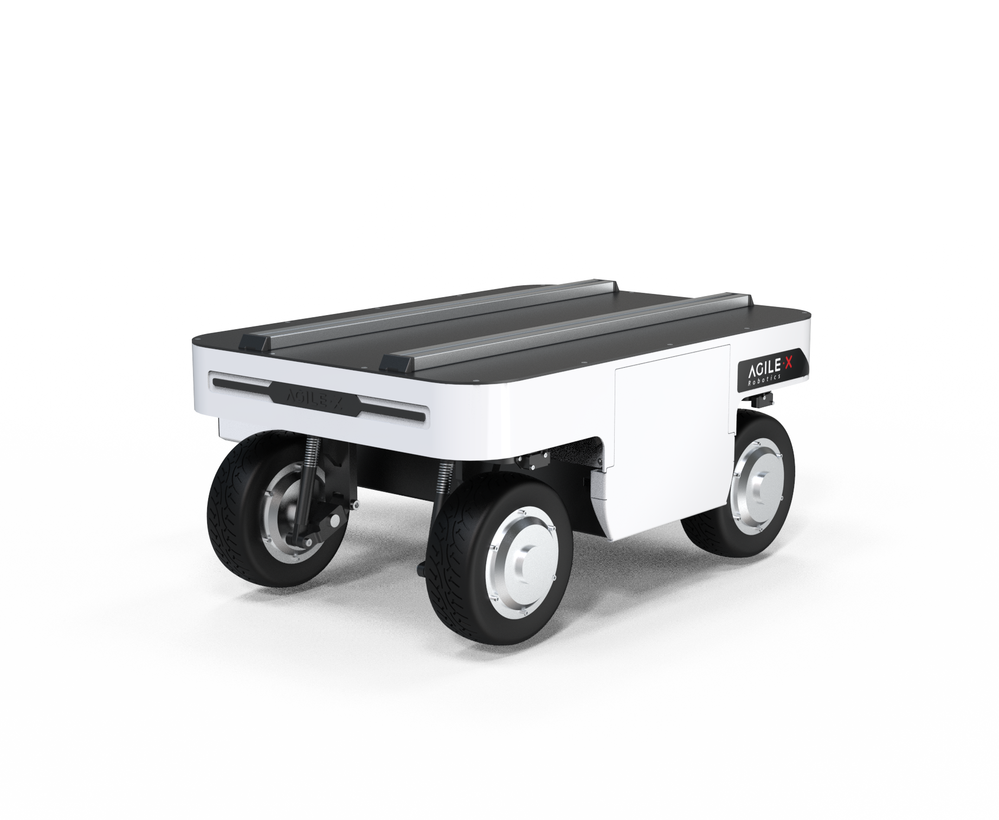
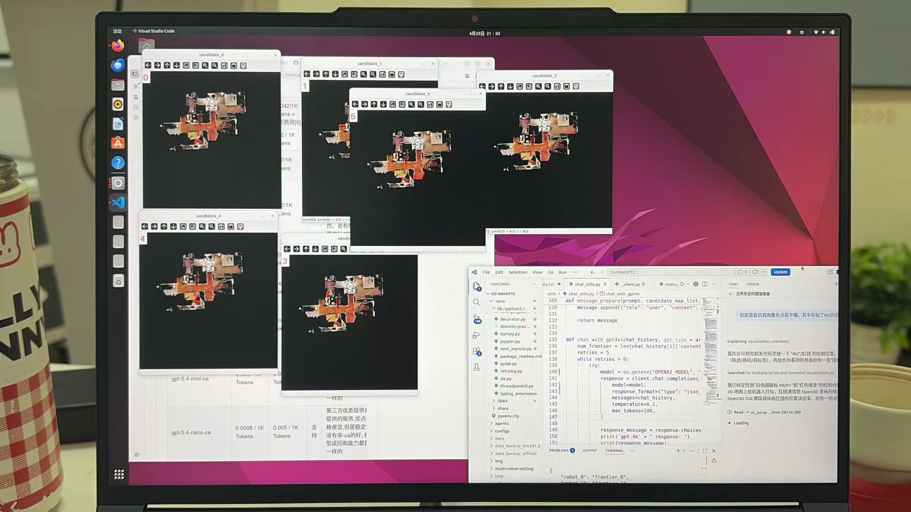
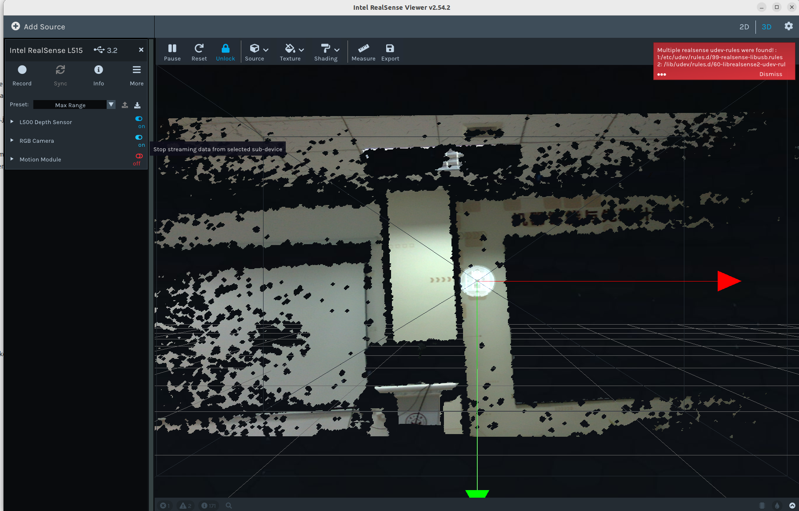

# 松灵小车使用与配置日志

这篇文档主要记录设备配置和使用说明，代码运行方法见 CoNav运行方法.md

**松灵小车所有指导文档见**
https://agilexsupport.yuque.com/staff-hso6mo/ttpor0/mqfbcehczwpz58fn?singleDoc=#


## 在此Ubuntu 22.04上安装ROS2
> 时间2026.4.17

由于此账户版本为Ubuntu22.04,因此安装ros版本为ros2 humble，凭`echo $ROS_DISTRO`检验。
安装使用的命令是

```bash
wget http://fishros.com/install -O fishros && . fishros
```

检验添加包是否成功，需要添加环境变量：
```bash
source ~/agilex_ws/install/setup.bash
```

教程文档见`~/松灵小车/ros2_readme.md`,文档来源https://github.com/agilexrobotics/ranger_ros2.git

以下的步骤提取自deepseek阅读此文档所得的指导。代码文件位于`~/alilex_ws/src`，目前含`ranger_ros2`和`ugv_sdk`.

## **运行小车代码，每次上电后，执行**

```bash
cd ~/agilex_ws
sudo bash src/ranger_ros2/ranger_bringup/scripts/bringup_can2usb.bash
```
检验方法：
```bash
ip link show can0

# 应该看到 can0: <NOARP,UP,LOWER_UP> 状态（UP 表示已启动）

# 测试接收 CAN 数据（需要连接机器人）
candump can0
# 如果连接正常，应该能看到数据输出（按 Ctrl+C 停止）
```

## 键盘控制方法：
> 时间2026.4.17



根据文档图片，我们的小车是ranger_mini_v2，或v3(?)按下面的命令运行：
```bash
cd ~/agilex_ws
source install/setup.bash
ros2 launch ranger_bringup ranger_mini_v3.launch.py

# 在另一个终端运行下面的命令：

cd ~/agilex_ws
source install/setup.bash
# 启动键盘控制
ros2 run teleop_twist_keyboard teleop_twist_keyboard
```

可以见到这样子的输出：
```plain
This node takes keypresses from the keyboard and publishes them
as Twist/TwistStamped messages. It works best with a US keyboard layout.
Moving around:
   u    i    o
   j    k    l
   m    ,    .
```
先按q/z键调节速度，然后在手柄确认取消驻车状态，按键盘例如u，m键则小车会因此而移动或旋转。

如果没有反应，检验方法是在第二个终端输入下面的命令看有没有预期结果。
```bash
# 查看所有 ROS2 节点
ros2 node list

# 应该看到类似 /ranger_base_node 等节点

# 查看话题列表
ros2 topic list

# 应该看到 /odom, /cmd_vel, /battery_state, /system_state 等话题

# 查看 odom 话题数据（确认有数据发布）
ros2 topic echo /odom --once
# 应该能看到位置和姿态信息

# 查看系统状态
ros2 topic echo /system_state
# 应该能看到机器人的状态信息
```
4.17检验得到已经成功**使用键盘控制**小车。
第一行（u i o）

    i：小车向前走
    u：向前 + 向左转弯（左前斜向）
    o：向前 + 向右转弯（右前斜向）

第二行（j k l）

    j：原地向左旋转（左转）
    k：停车！停止所有运动（最常用紧急停止键）
    l：原地向右旋转（右转）

第三行（m , .）

    m：向后 + 向左转弯（左后斜向）
    ,（逗号）：小车向后倒退
    .（小数点 / 点）：向后 + 向右转弯（右后斜向）


## SDK （cpp interface）

> 2026.4.17

按照`~/agilex_ws/src/ugv_sdk/README.md`的指导。

```bash
# 编译
cd ~/agilex_ws
colcon build --packages-select ugv_sdk
```

**每次上电后，执行**

```bash
cd ~/agilex_ws
sudo bash src/ranger_ros2/ranger_bringup/scripts/bringup_can2usb.bash
```
然后
```bash
# 启动内核模块,就算busy好像也是可以正常运行的。
sudo modprobe gs_usb
# 检测方法：见gs_usb
lsmod | grep gs_usb

# 启动can设备
sudo ip link set can0 up type can bitrate 500000
# 输出
RTNETLINK answers: Device or resource busy
# 检验与预期结果
# 查看网络接口
ifconfig -a

# 应该看到 can0 接口，类似：
# can0: flags=193<UP,RUNNING,NOARP>  mtu 16
```

推荐colcon环境，使用
```bash
source ~/agilex_ws/install/setup.bash

# 来到代码所在的地方
cd ~/agilex_ws/build/ugv_sdk/bin
# 运行 Ranger 示例
./demo_ranger_robot can0
```
现象是，轮子转动了一下，命令行内会打印每个轮子的角度和速度，以及车子状态等信息。示例代码有待阅读。
代码见`https://github.com/agilexrobotics/ugv_sdk.git`的`sample/ranger_robot_demo.cpp`.

**目前进度是能键盘操控车子，运行示例代码。**
> 4.17结束

**已拉取代码**
```bash
sudo apt update
sudo apt install -y git
mkdir -p ~/ws
cd ~/ws
git clone https://github.com/ybgdgh/Co-NavGPT2
cd Co-NavGPT2
```
## 运行co-nav2代码，每次开新终端，进项目先
```bash
cd ~/ws/Co-NavGPT
source .venv/bin/activate
which python
python --version
验证成功：python 路径在 Co-NavGPT2/.venv 下。
```
配置相机：
```bash
source ~/ws/Co-NavGPT2/.venv/bin/activate
```
## 已改动requirements.txt（旧
from
```bash
scikit-fmm==2019.1.30
scikit-learn==0.22.2.post1
scikit-image==0.15.0
numpy>=1.20.2
ifcfg
openai
tensorboard
```

to
```bash
scikit-fmm
scikit-learn
scikit-image
numpy<2
ifcfg
openai
tensorboard
```


**2026-04-19今天实际操作到的状态**

---

## 1. 今天我在做什么（目标与背景）

### 总目标
在 Ubuntu 22.04 + Python 3.10.12 环境下，把 **Co-NavGPT2** 的仿真环境配置完整，使得：
- 能运行 `python main.py` / `python main_vec.py`
- 不再出现 `habitat` / `habitat_sim` 相关 import 错误
- 后续可以下载 HM3D 数据集并跑评测/验证

### 当前工作路径（关键点）
- Co-NavGPT2 依赖并不只靠 `requirements.txt`，还需要 **Habitat 生态**：
  - `habitat-lab`（Python层环境/任务）
  - `habitat-sim`（C++/仿真核心，提供 `habitat_sim` Python模块）
- README 指定 `habitat-lab` 版本：`tags/v0.2.1`

---

## 2. 今天已经完成了什么（可复现状态）

### (A) Co-NavGPT2 仓库与 venv
- 目录：`~/ws/Co-NavGPT2`
- venv：`~/ws/Co-NavGPT2/.venv`
- Python：3.10.12
- `requirements.txt` 已安装完成，并且：
  - `python -m pip check` 曾显示 `No broken requirements found.`（在安装 requirements 后）

### (B) habitat-lab 安装
- 目录：`~/ws/habitat-lab`
- 已 `git checkout tags/v0.2.1`（detached HEAD，正常）
- 已在 Co-NavGPT2 的 venv 内执行过：
  - `python -m pip install -e .`
- 验证时 `import habitat` 会继续往下 import simulator，最终缺 `habitat_sim`（说明 habitat-lab 本体安装是成功的）。

### (C) NumPy / OpenCV 兼容性调整
- 由于 Gym 对 NumPy 2.x 有兼容性问题（会输出 warning），将 numpy 降级到了：
  - `numpy==1.26.4`（确认过 `python -c "import numpy; print(numpy.__version__)"`）
- 同时触发 OpenCV 与 numpy 的版本约束冲突：
  - 新版 OpenCV（4.13）要求 numpy>=2
- 已将 OpenCV 降到了能和 numpy 1.26 共存的版本：
  - `cv2 ok 4.11.0 numpy 1.26.4`（通过 `import cv2` 验证）

> 期间 `pip check` 出现过 `opencv-python` vs `opencv-python-headless` 的依赖要求不一致（habitat/ultralytics 要 opencv-python，supervision 要 headless）。这属于“依赖声明冲突”类问题，需要后续再统一处理（下次继续时会整理一个最终组合）。

### (D) habitat-sim 获取
- 目录：`~/ws/habitat-sim`
- 通过解决 GitHub HTTP2 问题（强制 HTTP/1.1）成功克隆了仓库：
  - `git clone --depth 1 https://github.com/facebookresearch/habitat-sim.git` 成功

---

## 3. 当前阻塞点是什么（报错原因与本质）

### 阻塞点 1：`import habitat` 报 `No module named habitat_sim`
- 这是**预期内**的缺失：`habitat-lab` 依赖 `habitat-sim`。
- 只有当 `habitat-sim` 安装完成并能 `import habitat_sim` 后，`import habitat` 才会完全成功。

### 阻塞点 2：安装 habitat-sim 时网络不稳定导致子模块 clone 超时
执行命令：
- `python setup.py install --headless`

安装过程中会自动拉取/更新第三方依赖（以 git 子模块方式），日志中出现：
- 正克隆到 `docs/m.css`
- 正克隆到 `src/deps/Sophus`
- 正克隆到 `src/deps/assimp`
- 正克隆到 `src/deps/bullet3`
- ……

关键失败：
- `error: RPC 失败。curl 28 Failed to connect to github.com port 443 ... 连接超时`
- `fatal: 无法克隆 'https://github.com/bulletphysics/bullet3' 到子模组路径 ...`
- 子模块 `bullet3` clone 失败，导致 habitat-sim 安装无法完成

### 为什么会这样（根因）
- 网络偶发不稳定/超时，导致 `git clone` 子模块（尤其 bullet3）失败。
- 这不是代码问题，而是**网络传输层问题**（你之前 clone habitat-sim 本体也遇到过类似问题，通过 HTTP/1.1 缓解过）。

你已经确认：
- `git config --global --get http.version` 为 `HTTP/1.1`（正确）

最后你为了不继续卡住，已 `Ctrl+C` 中断了安装进程（正确选择）。

---

## 4. 我现在处于什么状态（下次继续的起点）

- Co-NavGPT2 venv 已存在、基础依赖已装好
- habitat-lab v0.2.1 已安装（editable）
- habitat-sim 仓库已 clone 到本地，但 **habitat-sim 尚未成功安装到 venv**
- 失败原因：子模块（bullet3）clone 超时
- 你已中断安装，因此 `~/ws/habitat-sim/src/deps/` 下可能存在部分成功、部分半成品的依赖目录

---

## 5. 下次继续需要做什么（建议操作清单 + 每步验证）

> 下次继续时建议按“先把子模块拉齐，再安装”的策略，不要一上来就反复 `setup.py install` 让它自动重试。

### Step 1：确认进入正确 venv
```bash
cd ~/ws/Co-NavGPT2
source .venv/bin/activate
which python
python --version
```
**验证成功**：python 路径在 `Co-NavGPT2/.venv` 下。

### Step 2：在 habitat-sim 目录中同步并拉取子模块（串行 + 浅拉取，最稳）
```bash
cd ~/ws/habitat-sim
git submodule sync --recursive
git submodule update --init --recursive --depth 1
```
**验证成功**：命令结束不报错。

重点验证 bullet3 子模块是否到位：
```bash
test -d src/deps/bullet3/.git && echo "bullet3 submodule ok" || echo "bullet3 missing"
```

### Step 3：如果仍然 bullet3 超时（兜底方案）
- 记录失败输出（含 bullet3 URL 和超时信息）
- 采用“手动浅克隆 bullet3”或反复重试子模块更新（取决于网络状况）

（这一步下次我可以根据你当时的报错，给你精确的手动补齐命令。）

### Step 4：子模块齐全后，再安装 habitat-sim
```bash
cd ~/ws/habitat-sim
python -m pip install -r requirements.txt
python setup.py install --headless
```

**硬验证点（最关键）**：
```bash
python -c "import habitat_sim; print('habitat_sim ok')"
```

### Step 5：验证 habitat-lab 能完整 import
```bash
python -c "import habitat; print('habitat ok')"
```

### Step 6：验证 Co-NavGPT2 程序入口
```bash
cd ~/ws/Co-NavGPT2
python main.py -h
```

### Step 7：完成数据集下载与目录结构（仿真完整跑通必需）
- 按 README 下载 HM3D v0.2 minival，并放到 `Co-NavGPT2/data/...` 结构下
- 验证目录存在：
```bash
cd ~/ws/Co-NavGPT2
ls -la data
```

---

## 6. 备注（今天遇到的“容易复发问题”）
1. **网络不稳定**会反复导致 habitat-sim 子模块 clone 失败；需要优先保证子模块拉取成功再编译。
2. **NumPy 2.x 与 Gym/Habitat 老版本不兼容**（warning/潜在运行问题），保持 `numpy<2` 更稳。
3. `opencv-python` 与 `opencv-python-headless` 的依赖声明冲突可能导致 `pip check` 不干净；后续如果要彻底“干净”，需要统一最终 OpenCV 安装策略（下次继续时一并收敛）。

---

如果你愿意，我建议你把今天的日志最后再补两条“快照信息”，下次继续时会更省事：

```bash
# 记录当前关键包版本
python -c "import numpy; print('numpy', numpy.__version__)"
python -c "import cv2; print('cv2', cv2.__version__)" 2>/dev/null || true
python -m pip freeze > ~/ws/Co-NavGPT2/freeze-2026-04-19.txt
```

下次你一回来，只要告诉我：子模块 update 卡在哪个仓库（比如 bullet3 还是别的），我就能给你最短路径把 `habitat_sim` 装起来并完成整套配置。
-以上为4.19的工作

## 推荐你的阶段路线（最省时间）
阶段 A：跑通仿真（你现在的目标，建议完成）

你需要的最小清单：

    HM3D（至少 minival）+ ObjectNav episodes
    OPENAI_API_KEY（如果代码路径必须调用 LLM）
    python main.py 能跑一个 episode 并产生日志/结果

阶段 B：上车前的“接口改造”（关键）

把 Co-NavGPT2 拆成两层：

    高层决策/语义导航策略（尽量保留原样）
    底层控制与定位：替换为 ROS2/你的车控制（Twist）、SLAM（nav2/RTAB-Map/ORB-SLAM3）、代价地图避障等

阶段 C：实车集成

    传感器驱动（相机/深度/LiDAR）
    定位与地图
    安全：急停、速度限制、避障冗余
    在线/离线 LLM（网络不稳定时的降级策略）

1) 先准备一个 Matterport 账号（必须）

    打开 Matterport 官网并注册/登录（用你常用邮箱即可）。
    确保你能登录到 my.matterport.com 这个控制台（这是后面生成 token 的地方）。

    如果你已经有 Matterport 账号，就跳过。

2) 在 Matterport 里生成 API Token（这就是你要的 “api-token-id/secret”）

    登录后打开开发者工具页：
    https://my.matterport.com/settings/account/devtools
    在页面里找到 API Tokens（或类似区域），点 Create/Generate token
    你会得到两段内容：
        Token ID → 对应下载命令里的 --username
        Token Secret → 对应下载命令里的 --password（通常只显示一次，立刻保存）

这两段就是 README 里说的 <api-token-id> 和 <api-token-secret>。
3) 用 token 通过 habitat-sim 的工具下载（推荐下载到项目 data 目录）

你已经建好了目录，推荐直接下载到 ~/ws/Co-NavGPT2/data：
bash

cd ~/ws/Co-NavGPT2
source .venv/bin/activate

python -m habitat_sim.utils.datasets_download \
  --username <api-token-id> \
  --password <api-token-secret> \
  --uids hm3d_minival_v0.2 \
  --data-path ./data

    hm3d_minival_v0.2 是 HM3D 的小子集，适合先把仿真跑通。 (aihabitat.org)

4) 验证下载是否成功
bash

cd ~/ws/Co-NavGPT2
find data -maxdepth 4 -type d -iname "*hm3d*" | head


-以上为4.20工作日志，配好了环境，下一步是下数据集来跑仿真

## 4.21日志
尝试申请APIkey，发现不能直接在官网申请，因为支付渠道不支持。在网上找到了一些国内商，正在测试其提供的apikey是否可用。尚未充值，有一点点初始化额度.测试后输出“不正确的APIkey”，原来它申请的 ChatNode API Key 是用来调用你自己在 ChatNode 上创建的机器人的，而不是直接调用 OpenAI 的模型接口。

在官网申请了一个没有使用额度的API key，正在尝试申请虚拟银行卡或寻找代充，看起来都很有风险。正在联系闲鱼商家。在咸鱼上找来一个，见APIkey.txt


✅ .basis.glb 存在（你已经确认）
✅ hm3d_minival_basis.scene_dataset_config.json 在 HM3D 根目录（按第 1 步补齐）
✅ 最小脚本 Simulator created OK（第 2 ���）
⏳ Co-NavGPT2 任务 episodes 就位（下一步需要 grep 确认）
⏳ OpenAI key / 或离线模式能够启动 main（根据你的阶段目标选择）

已成功下载并解压 ObjectNav HM3D 数据集；发现官方 val/val.json.gz 为索引壳文件（episodes 为空），真实 episodes 位于 val/content/*.json.gz。
由于当前环境使用 Habitat-Lab 0.2.1（仅支持单文件 episodes），编写合并脚本将 val/content 分片合并生成单文件 data/datasets/objectnav_hm3d_v2/val/val.json.gz。
合并后验证 episodes=2000，数据集加载不再为空，进入下一阶段：解决 scene_id 与本地 HM3D 资产/scene_dataset_config 的匹配问题。

需要——在你当前这条路径（运行 Co-NavGPT2 代码，并且它内部用 Habitat-Lab 的 Env(config=...) 来起环境）下，你必须有 episodes，否则环境连 reset() 都起不来，Co-NavGPT2 的主循环也就无法跑通。

原因很直接：你现在的报错链路一直是

Env(config) → make_dataset() → 读 DATASET.DATA_PATH → assert len(self._dataset.episodes) > 0

这说明 Co-NavGPT2 当前实现是“数据集驱动的 Habitat 任务模式”，不是“纯仿真引擎模式”。所以没有 episodes（或 episodes 被过滤为 0）就会直接崩。
但这里有一个关键补充：你不一定要下载/使用“HM3D ObjectNav v2 episodes”

为了“先把系统跑起来、再对接真车接口”，你最省时间的选择是：
方案 1（推荐）：先用最容易跑通的 episodes（PointNav test / Gibson / MP3D ObjectNav）

    目的：让 Co-NavGPT2 的 主程序流程（初始化 env、拿 observation、产生日志、动作输出）跑通。
    这一步只需要 episodes “存在且能加载”，不需要完全贴合你最终真车任务。

方案 2：继续坚持 HM3D ObjectNav v2

    你现在已经看到：它和 habitat-lab 0.2.1 的数据格式/过滤逻辑冲突，会不断消耗时间（合并、清洗、再被过滤、再修）。

如果你“起码得上真车对接接口”，episodes 还必须吗？

    对 Co-NavGPT2 现有代码来说：必须。
    除非你愿意改代码：把 Env(config) 这一层替换为你自己的 RealRobotEnv（ROS/驱动读取传感器、发布速度），那样就不需要 episodes 了。但那已经是“开始做真车接口适配”的开发工作了。

换句话说：

    不想改代码 → 需要 episodes（用一个容易的先跑通）
    愿意改代码做接口层 → 可以先不需要 episodes，但要实现一套替代环境

我服了-21：48

## 4.25日志
每次打开新终端都要运行：
export OPENAI_API_KEY="sk-QlHlIG4WgoU7NP0Li8mlwndbGH6Dw8gIIQTIB5PHNHI1GDgb"
export OPENAI_BASE_URL="https://api.chatanywhere.tech/v1"

## 4.27
运行仿真：
```bash
cd ~/ws/Co-NavGPT
source .venv/bin/activate
python main.py --num_agents 1
```
观察到仿真的窗口成功显示如图（彭舒婷于4.25录制）：



今天按照https://github.com/realsenseai/librealsense 的要求安装了相机的realsense，
在.venv环境下安装了pyrealsense2

试验代码见`~/ws/Co-NavGPT2/realsense/pyrealsense.py`,

## 4.30
配置相机时，需要更新python路径变量
```bash
source ~/ws/Co-NavGPT2/.venv/bin/activate
export PYTHONPATH=$PYTHONPATH:/usr/local/lib
```
尚未运行实例代码，因此将备用方案留存：
*Note*: If this doesn't work, try using the following path instead: `export PYTHONPATH=$PYTHONPATH:/usr/local/lib/[python version]/pyrealsense2`

Alternatively, copy the build output (`librealsense2.so` and `pyrealsense2.so`) next to your script. Note: Python 3 module filenames may contain additional information, e.g. pyrealsense2.cpython-35m-arm-linux-gnueabihf.so

完成下载SDK bundle并安装，于`~/realsenseai/librealsense`

师兄说要安装 pyrealsense2 realsense-viewer realsense-ros librealsense

## 5.1

根据`~/realsenseai/librealsense/doc/distribution_linux.md`的指示安装包
可以使用`realsense-viewer`来运行这个viewer
viewer运行成功了，但这个515而不是455就不适配了

现在更换了viewer的版本为2.54.2,使用上面的运行命令可以运行了，见效果如下：


需要装的东西：
- [x] pyrealsense2 
- [x] realsense-viewer 
- [x] realsense-ros 
- [x] librealsense

<a id="prev"></a>为了装pyrealsense，找可支持的版本2.51.1又装了一次。但是这个2.51.1是在~/.bashrc环境（默认环境）而非论文的环境里的。如果在环境内打开realsense-viewer,会打开那个ros2默认的，不支持515的相机的版本。

成功覆盖，在.venv里也是2.51.1的realsense-viewer了

## 5.7

1) 验证可用与版本

```bash
python3 -c "from pyrealsense2 import pyrealsense2 as rs; print(rs.__version__)"
python3 -c "import importlib.util as u; print('pyrealsense2:', bool(u.find_spec('pyrealsense2')))"
```

2) 安装依赖（保存图片/转 numpy 用）
```bash
python3 -m pip install -U numpy opencv-python
```

6) 实时预览(经检验，成功运行)
```bash
python3 - <<'PY'
from pyrealsense2 import pyrealsense2 as rs
import numpy as np, cv2

pipe = rs.pipeline()
cfg = rs.config()
cfg.enable_stream(rs.stream.color, 1280, 720, rs.format.bgr8, 30)
pipe.start(cfg)

try:
    while True:
        frames = pipe.wait_for_frames()
        color = frames.get_color_frame()
        img = np.asanyarray(color.get_data())
        cv2.imshow("color", img)
        if (cv2.waitKey(1) & 0xFF) == ord('q'):
            break
finally:
    pipe.stop()
    cv2.destroyAllWindows()
PY
```

根据上面的检验和`~/rs515/realsense_tryout/`中的试验代码（用命令`python3 文件名`运行），知`pyrealsense2`可以回传图像。

下面是realsense-ros的检验：[上次](#prev)已经安装，执行了固件升级，仍然输出相同的错误。估计要绕过它了

**检验命令``ros2 launch realsense2_camera rs_launch.py`,另一边`ros2 topic list | grep -E 'camera|realsense'`, 仍然报错。**

目前结论是：固件升级成功，但 ROS 所用的 librealsense 2.57.7 这套库依旧枚举不到 L515（而 2.51.1 可以）。因此接下来要么换一套“能枚举到 L515 的 2.57.7 librealsense”（官方 apt 包或源码编译），要么改为编译一个与 2.51.1 匹配的 `realsense-ros`。

## 5.14 使用ros2而非ugv sdk控制小车

现设计了`~/agilex_ws/src/ranger_ros2/ranger_bringup/scripts`的一段代码服务于用ros2发布话题控制小车。已经编译：`cd ~/agilex_ws && colcon build --packages-select ranger_bringup && source install/setup.bash`

使用方法是输入下面的命令：

```bash
cd ~/agilex_ws
source install/setup.bash
ros2 launch ranger_bringup ranger_mini_v3.launch.py

# 在另一个终端运行下面的命令：
# 这两行不知道要不要
cd ~/agilex_ws
source install/setup.bash
```

- 直行 0.5 m/s，持续 3 秒后自动发 0 停车并退出：
  `ros2 run ranger_bringup cmd_vel_publisher.py --linear-x 0.5 --angular-z 0.0 --duration 1`

- 原地转向（角速度 0.8 rad/s），持续 2 秒：
  `ros2 run ranger_bringup cmd_vel_publisher.py --linear-x 0.0 --angular-z 0.8 --duration 2`

- 一直发布（手动 Ctrl+C 退出，默认会补发一次 0 停车）：
  `ros2 run ranger_bringup cmd_vel_publisher.py --linear-x 0.3 --angular-z 0.2`

  

每开一个新终端，都要重新执行：

```
source /opt/ros/humble/setup.bash
source ~/agilex_ws/install/setup.bash
```

然后检查 package 是否还在：

```
ros2 pkg list | grep ranger
```

能看到 `ranger_base`、`ranger_bringup`、`ranger_msgs` 就说明新终端环境也正确了。

ros2 topic list -t
/actuator_state [ranger_msgs/msg/ActuatorStateArray]
/battery_state [sensor_msgs/msg/BatteryState]
/cmd_vel [geometry_msgs/msg/Twist]
/motion_state [ranger_msgs/msg/MotionState]
/odom [nav_msgs/msg/Odometry]
/parameter_events [rcl_interfaces/msg/ParameterEvent]
/rosout [rcl_interfaces/msg/Log]
/system_state [ranger_msgs/msg/SystemState]
/tf [tf2_msgs/msg/TFMessage]


```
原机器狗控制链路：
Co-NavGPT2 -> ZMQ speedctl -> Unitree/机器狗控制端

Ranger 替换链路：
Co-NavGPT2 -> ZMQ speedctl -> adapter -> /cmd_vel -> Ranger
```

而不是：

```
Co-NavGPT2 -> /robot_action -> /cmd_vel -> Ranger
```


也就是说，后面我们可以把 Ranger 的 adapter 设计成：

```
Co-NavGPT2
  -> ZMQ PUB 发送 b"speedctl speed|vx|vy|yaw"
  -> adapter 用 ZMQ SUB 接收
  -> adapter 转成 /cmd_vel
  -> Ranger 小车执行
```

当前阶段可以确认：

```
Ranger 底盘：
/cmd_vel 可控
/odom 正常
odom -> base_link 正常

Co-NavGPT2 控制出口：
ZMQ PUB speedctl 已确认
已改为 tcp://127.0.0.1:5557
adapter 可接收并转 /cmd_vel

Co-NavGPT2 TF：
已从 camera_init_1/body_1 临时改为 odom/base_link
语法检查通过

Co-NavGPT2 相机输入：
仍等待 /robot1/camera/... 三个 topic
```

因为相机现在还没解决，真实 topic 名也还不知道。等队友把 L515 或其他相机驱动跑起来后，我们再根据实际输出决定改法。

后面相机接入时，你只需要让真实相机 topic 对齐到这三个名字之一：

```
方案 A：改 Co-NavGPT2 代码
真实相机 topic 是什么，就把 102、103、116 行改成什么。

方案 B：保留 Co-NavGPT2 原代码
通过 remap / namespace 把真实相机 topic 映射成 /robot1/camera/...。
```

当前阶段建议记录为：

```
待相机组提供真实 ROS2 topic：
1. RGB image topic
2. aligned depth image topic
3. color camera_info topic
```

## 5.15

**今天解决了librealsense 2.57.7识别不到相机与2.51.1的冲突问题**

核心思路：把 ROS2 wrapper 的“编译期头文件版本”和“运行期链接库版本”统一到同一套 librealsense（2.51.1），避免系统里 /opt/ros/humble（2.57.7）与 /usr/local（2.51.1）混装导致 ABI/符号不匹配。

- 根因定位：`realsense2_camera` 插件 `dlopen` 崩溃报 `undefined symbol: rs2_create_context_ex`，说明编译时用了较新头文件（2.57.7）引用了新符号，但运行时却加载了较旧库（2.51.1）不包含该符号。
- 修复策略：
  - 选定“已验证能枚举 L515”的 /usr/local [librealsense](vscode-file://vscode-app/usr/share/code/resources/app/out/vs/code/electron-browser/workbench/workbench.html) 2.51.1 作为唯一基线。
  - 从源码构建与之匹配的 `realsense-ros`（tag 4.51.1）。
  - 在 wrapper 的 CMake 中强制 `find_package(realsense2 2.51.1 EXACT REQUIRED)`，并通过 shim include 把 2.51.1 的头文件目录放到 include 搜索最前，确保不会被 ROS underlay 的 2.57.7 头文件抢占。
- 验证闭环：
  - [rs-enumerate-devices](vscode-file://vscode-app/usr/share/code/resources/app/out/vs/code/electron-browser/workbench/workbench.html) 能枚举 L515。
  - `ros2 launch realsense2_camera rs_launch.py` 日志显示 `Built/Running with LibRealSense v2.51.1`，并成功找到设备、发布 `/camera/*` 话题；`ros2 topic echo --once` 能取到图像/深度数据。


### 启动相机节点

```bash
# 终端 A: 启动相机节点
cd ~/rs515/ros2_ws
source install/setup.bash
ros2 launch realsense2_camera rs_launch.py

# 终端 B: 确认话题与数据
cd ~/rs515/ros2_ws
source install/setup.bash 
ros2 topic list | grep -E 'camera|realsense'
ros2 topic echo --once /camera/color/image_raw
```

可以看到相机话题了

```plain
/camera/color/camera_info
/camera/color/image_raw
/camera/color/metadata
/camera/confidence/camera_info
/camera/confidence/image_rect_raw
/camera/confidence/metadata
/camera/depth/camera_info
/camera/depth/image_rect_raw
/camera/depth/metadata
/camera/extrinsics/depth_to_color
/camera/extrinsics/depth_to_confidence
/camera/extrinsics/depth_to_infra
/camera/imu
/camera/infra/camera_info
/camera/infra/image_rect_raw
/camera/infra/metadata
```

如果接口在占用也会看不到因此

```bash
# 查看是否还有旧节点在运行
pgrep -af realsense2_camera_node

# 如果已经停掉所有相机的命令行上一条仍有输出，
pkill -f realsense2_camera_node

# 验证已释放：
# 如未释放，报RS2_USB_STATUS_BUSY / failed to claim usb interface；正常打印L515信息则已经释放。
/usr/local/bin/rs-enumerate-devices
# 进程查看。
pgrep -af 'realsense2_camera_node|realsense-viewer'
# USB 节点侧验证（找出具体占用进程
node=$(lsusb | awk '/8086:0b64/{printf "/dev/bus/usb/%03d/%03d",$2,substr($4,1,length($4)-1)}')
sudo fuser -v "$node"
```

## 5.18

在 `ros_single_nav.py` 已经完成了三处关键适配：

```
1. ZMQ 控制出口：
   tcp://192.168.100.1:5557
   改为
   tcp://127.0.0.1:5557

2. TF：
   camera_init_1 -> body_1
   改为
   odom -> base_link

3. 相机 topic：
   /robot1/camera/color/image_raw
   改为
   /camera/color/image_raw

   /robot1/camera/aligned_depth_to_color/image_raw
   改为
   /camera/aligned_depth_to_color/image_raw

   /robot1/camera/color/camera_info
   改为
   /camera/color/camera_info
```

也就是说，单机器人版本现在已经基本对齐你的 Ranger + L515 环境。


 transforms3d依赖旧版本的nunmpy，现在numpy版本降级到1.23.5

### 代码改动

ros_single_nav.py 修改：
- ZMQ IP: 192.168.100.1 -> 127.0.0.1
- camera topic 改为 /camera/color/image_raw、/camera/aligned_depth_to_color/image_raw、/camera/color/camera_info
- TF 改为 odom -> base_link，使用 rclpy.time.Time()
- rgbd_callback 增加 RGB/Depth 尺寸保护

新增文件：
- ~/zmq_to_cmd_vel_adapter.py

  关于RGB/Depth 尺寸保护：

```
cd ~/ws/Co-NavGPT2
gedit ros_single_nav.py
```

找到第 134 行附近：

```
def rgbd_callback(self, rgb_msg, depth_msg):
```

把 139–150 行这段：

```
h = rgb_msg.height
w = rgb_msg.width

# RGB
rs_rgb = np.frombuffer(rgb_msg.data, dtype=np.uint8).reshape(h, w, 3)
self.obs['rgb'] = rs_rgb

# Depth
# 注意：如果你的深度图编码是 16UC1，需要确认 byte ordering
depth_dtype = np.uint16  # 如果是16UC1
rs_depth = np.frombuffer(depth_msg.data, dtype=depth_dtype).reshape(h, w)
self.obs['depth'] = rs_depth
```

改成这个更稳的版本：

```
rgb_h = rgb_msg.height
rgb_w = rgb_msg.width
depth_h = depth_msg.height
depth_w = depth_msg.width

if rgb_h != depth_h or rgb_w != depth_w:
    self.get_logger().warn(
        f"RGB/Depth size mismatch: "
        f"rgb={rgb_w}x{rgb_h}, depth={depth_w}x{depth_h}. Skip this frame."
    )
    return

# RGB
rs_rgb = np.frombuffer(rgb_msg.data, dtype=np.uint8).reshape(rgb_h, rgb_w, 3)
self.obs['rgb'] = rs_rgb

# Depth
depth_dtype = np.uint16  # 16UC1
rs_depth = np.frombuffer(depth_msg.data, dtype=depth_dtype).reshape(depth_h, depth_w)
self.obs['depth'] = rs_depth
```

这样即使偶尔收到尺寸不一致的帧，程序也不会崩溃，而是跳过这一帧。

成果：

1. Ranger bringup 成功
2. /odom 稳定约 50Hz
3. odom -> base_link TF 可用
4. /cmd_vel 手动控制正常
5. CAN 异常原因定位到线没接好，并已恢复到 ERROR-ACTIVE
6. RealSense L515 已经能发布 ROS2 topic
7. align_depth.enable:=true 后出现 /camera/aligned_depth_to_color/image_raw
8. ros_single_nav.py 相机 topic 已改为真实 topic
9. ros_single_nav.py TF 已改为 odom -> base_link
10. Co-NavGPT2 原 ZMQ 控制出口已确认
11. 新增 ZMQ -> /cmd_vel adapter，并验证可控制 Ranger
12. .venv 依赖基本补齐，torch GPU 可用
13. ros_single_nav.py 能运行，能输出 received tf 和 Action published


当前链路已经是：

```
RealSense RGB-D
    ↓
ros_single_nav.py
    ↓
TF: odom -> base_link
    ↓
ZMQ speedctl
    ↓
zmq_to_cmd_vel_adapter.py
    ↓
/cmd_vel
    ↓
Ranger Mini 3.0
```

### 但是

Open3D 可视化结果还没有正常显示出来

RealSense 的 aligned depth 本身在运行中不稳定，目标尺寸是height: 720, width:1280,有时候会输出height:480,width:640


### 下一次来实验室第一步做什么？

<a id="stablize"></a>下一次不要从 Co-NavGPT2 开始，先从相机分辨率稳定性开始。

#### Step 1：启动相机时固定 RGB 和 depth 分辨率

目标是让 RGB 和 aligned depth 都稳定为同一个尺寸。建议优先固定为：

```
640×480
```

原因：

```
1. 和 depth 原始分辨率一致
2. 数据量更小，实时性更好
3. 更适合小车联调
4. 避免 1280×720 与 640×480 混用
```

下一次先查 RealSense 参数名：

```
ros2 param list /camera/camera | grep -E "profile|width|height|fps|align"
```

然后根据参数名重启相机，大概率会用类似这种形式：

```
ros2 launch realsense2_camera rs_launch.py \
  align_depth.enable:=true \
  rgb_camera.profile:=640x480x30 \
  depth_module.profile:=640x480x30
```

具体参数名要以下次 `ros2 param list` 输出为准。

------

#### Step 2：验证 aligned depth 是否稳定

重新启动相机后，执行：

```
for i in {1..20}; do
  echo "---- frame $i ----"
  ros2 topic echo --once /camera/aligned_depth_to_color/image_raw | grep -E "frame_id|height|width|encoding"
done
```

目标是 20 次全部一致，例如：

```
frame_id: camera_color_optical_frame
height: 480
width: 640
encoding: 16UC1
```

同时也检查 RGB：

```
ros2 topic echo --once /camera/color/image_raw | grep -E "frame_id|height|width|encoding"
```

目标：

```
height: 480
width: 640
encoding: rgb8
```

只有这一步稳定了，再继续跑 Co-NavGPT2。

------

#### Step 3：如果固定到 640×480，需要同步检查 CameraInfo

检查：

```
ros2 topic echo --once /camera/color/camera_info | head -n 30
```

确认 CameraInfo 也对应当前 color 图像分辨率。Co-NavGPT2 使用的是：

```
fx = msg.k[0]
fy = msg.k[4]
cx = msg.k[2]
cy = msg.k[5]
```

所以 CameraInfo 必须来自 color camera：

```
/camera/color/camera_info
```

这个你现在已经改对了。

------

#### Step 4：再按顺序启动完整系统

下一次建议启动顺序固定为：

```
1. 相机节点，带 align_depth 和固定分辨率
2. Ranger bringup
3. 检查 can0 是 ERROR-ACTIVE
4. 检查 /odom 约 50Hz
5. 启动 ZMQ adapter
6. 激活 .venv，运行 ros_single_nav.py
```

不要一上来就跑 Co-NavGPT2。

------

### 四、预估还要多久？

如果只是解决 Open3D 没显示的问题，时间大概这样：

```
固定 RealSense 分辨率并验证稳定：20–40 分钟
重新跑 ros_single_nav.py 并观察 GUI：20–40 分钟
如果 Open3D 仍不显示，继续查可视化线程/队列/agent 输出：1–2 小时
```

所以比较乐观的情况：

```
下次 1 小时内可以确认 Open3D 是否开始显示点云/地图
```

比较现实的情况：

```
还需要 2–3 小时，把相机 profile、可视化数据流、mapping 输出再查一轮
```

如果还涉及模型权重、语义图、GUI 图片路径或队列通信问题，可能会更久。

------

### 五、下次来的核心目标

不要把目标定成“完全跑通 Co-NavGPT2”。下一次目标建议定成：

```
让 /camera/color/image_raw 和 /camera/aligned_depth_to_color/image_raw 稳定同尺寸；
然后让 Open3D 至少显示出 RGB-D 点云或轨迹变化。
```

只要这一步完成，你的真实小车单机器人接入就基本进入“可调效果”的阶段，而不是“接口还没通”的阶段。

## 5.22

**安装雷达**


上图为雷达及其*一分三线*。雷达接线方式为，一分三线中，网线接电脑，圆头电源线找604的一个同学的雷达电源线借用，分叉有很多颜色的头悬空。连上之后听到雷达发出轻微响声。

<span style="color: red;">**注意， 在固定雷达在小车上之前，用完雷达放回盒子并放入604相机的柜子里**</span>

根据师兄提供的教程，需要安装的东西如下：

- [x] Livox SDK2 (代码位于`~/ws/Livox-SDK2`)
- [x] livox_ros_driver2(代码位于`~/ros2_ws/src/livox_ros_driver2`)

配置Livox SDK2关键步骤如下：（下载源码等步骤省略）

```bash
# 按照说明书，设置静态IP（已经调好无需再执行）
cd /etc/netplan
sudo vim 01-network-manager-all.yaml
# 按说明书的要求修改的IP
sudo netplan apply
# 这时接上线，
ip addr
# 可以见到包含下面的输出
2: enp5s0: <BROADCAST,MULTICAST,UP,LOWER_UP> mtu 1500 qdisc fq_codel state UP group default qlen 1000
    link/ether b0:25:aa:94:d2:79 brd ff:ff:ff:ff:ff:ff
    inet 192.168.1.50/24 brd 192.168.1.255 scope global noprefixroute enp5s0
       valid_lft forever preferred_lft forever
    inet6 fe80::422:1ba8:2461:b5b3/64 scope link noprefixroute 
       valid_lft forever preferred_lft forever

# 使用这个命令检查（这是一行命令！）
./livox_lidar_quick_start ~/ws/Livox-SDK2/samples/livox_lidar_quick_start/mid360_config.json
# 输出包含，且不断刷新出现
point cloud handle: 2046929088, data_num: 96, data_type: 1, length: 1380, frame_counter: 0
```

经检查已经成功安装。

安装livox ros driver2如下：

```bash
# 由于那个文件夹里还有librealsense，为免相互干扰，使用编译命令：
set -e
source /opt/ros/humble/setup.bash
cd /home/isee-cdh/ros2_ws
colcon build --packages-select livox_ros_driver2 --cmake-args -DROS_EDITION=ROS2 -DDISTRO_ROS=humble
```

- 关键修正：把 `ros2_ws/src/livox_ros_driver2/config/MID360_config.json`里的 `host_net_info` 统一改为 `192.168.1.50`，雷达 IP探测到为  `192.168.1.122`。
- 运行结果：启动 [msg_MID360_launch.py] 后已看到驱动进入发布状态（日志显示 `livox/lidar publish use livox custom format`、`livox/imu publish use imu format`）。
- 话题与频率验证（实测）：
  - `/livox/lidar`：类型 `livox_ros_driver2/msg/CustomMsg`，发布频率约 10 Hz10*Hz*
  - `/livox/imu`：类型 `sensor_msgs/msg/Imu`，发布频率约 200 Hz200*Hz*

```bash
# 后续检测，第一个终端输入
source /opt/ros/humble/setup.bash
source ~/ros2_ws/install/setup.bash
ros2 launch livox_ros_driver2 msg_MID360_launch.py

# 第二个终端输入
source /opt/ros/humble/setup.bash
source ~/ros2_ws/install/setup.bash

ros2 interface show livox_ros_driver2/msg/CustomMsg
ros2 topic list | grep -E '^/livox' || true
ros2 topic hz /livox/lidar
# 观察到第二个终端输出
std_msgs/Header header    # ROS standard message header
	builtin_interfaces/Time stamp
		int32 sec
		uint32 nanosec
	string frame_id
uint64 timebase           # The time of first point
uint32 point_num          # Total number of pointclouds
uint8  lidar_id           # Lidar device id number
uint8[3]  rsvd            # Reserved use
CustomPoint[] points      # Pointcloud data
	uint32 offset_time      #
	float32 x               #
	float32 y               #
	float32 z               #
	uint8 reflectivity      #
	uint8 tag               #
	uint8 line              #

/livox/imu
/livox/lidar
WARNING: topic [/livox/lidar] does not appear to be published yet
average rate: 10.024
	min: 0.097s max: 0.102s std dev: 0.00145s window: 11
average rate: 10.002
	min: 0.097s max: 0.104s std dev: 0.00188s window: 21
average rate: 9.999
	min: 0.094s max: 0.108s std dev: 0.00245s window: 32
average rate: 9.999
```

**到这，师兄所要求的安装雷达的要求应该是完成了**

建图SLAM算法：[FAST-LIO](https://github.com/hku-mars/FAST_LIO)，正在研究......


## 6.8

戈畅推荐的spark-fast-lio可能不可行，不一定适配我们的雷达Livox MID-360 ,换用Ericsii/FAST_LIO_ROS2

确认：我们的有线网卡是enp5s0

电脑有线网卡 IP，也就是 host IP为：192.168.1.50

MID-360 雷达 IP为：192.168.1.122

把电脑的有线网卡 `enp5s0` 设置成：

```
192.168.1.50/24
```

这样电脑和雷达就在同一网段：

```
电脑：192.168.1.50
雷达：192.168.1.122
```

现在已经确认：

```
/livox/lidar 频率 ≈ 10 Hz
/livox/imu   频率 ≈ 200 Hz
```

并且 topic 类型是：

```
/livox/lidar : livox_ros_driver2/msg/CustomMsg
/livox/imu   : sensor_msgs/msg/Imu
```

#### 现在这条链路已经通了：

```
MID-360
  ↓
livox_ros_driver2
  ↓
/livox/lidar: livox_ros_driver2/msg/CustomMsg, 10Hz
/livox/imu: sensor_msgs/msg/Imu, 200Hz
  ↓
FAST_LIO_ROS2
  ↓
/cloud_registered
/Laser_map
/path
/Odometry
```

目前已经完成：

```
1. ROS2 Humble 正常
2. livox_ros_driver2 正常
3. MID-360 网络通信正常
4. /livox/lidar 正常，10Hz，CustomMsg
5. /livox/imu 正常，200Hz，sensor_msgs/Imu
6. FAST_LIO_ROS2 编译成功
7. mid360.yaml 可用
8. /Odometry、/cloud_registered、/path、/tf 正常发布
9. 静止时漂移很小
10. 直线移动时位移尺度基本正确
```

关于坐标系：

camera_init ≈ FAST-LIO 的建图起点 / 初始世界坐标系
body ≈ 雷达-IMU 机体坐标系

### 最终支架固定后，理想 TF 应该是什么？

支架固定后，推荐整理成：

```
map 或 camera_init
   └── base_link
        └── livox_frame
```

或者更符合 FAST-LIO2 当前命名的版本：

```
camera_init
   └── base_link
        └── livox_frame
```

## 现在还没完成的核心问题

现在有两套 TF：

```
FAST-LIO2:
camera_init
   └── body

Ranger:
odom
   └── base_link
```

它们还没有统一。

也就是说，FAST-LIO2 知道“雷达/IMU body 在哪里”，Ranger 知道“小车 base_link 在哪里”，但系统还不知道：

```
body 和 base_link 到底是什么关系？
livox_frame 和 base_link 到底是什么关系？
camera_link 和 base_link 到底是什么关系？
```

## 支架固定后必须确认什么

支架固定后，重点确认这几件事。

### 第一，雷达相对小车的位置

要测量：

```
base_link -> livox_frame
```

也就是 MID-360 相对小车底盘中心的位置：

```
x：雷达在 base_link 前方多少米
y：雷达在 base_link 左/右多少米
z：雷达离 base_link 高多少米
```

例如：

```
x = 0.20 m
y = 0.00 m
z = 0.35 m
```

但这个必须按你们实际支架测量，不能照抄。

------

### 第二，雷达相对小车的朝向

要确认 MID-360 的坐标轴和小车坐标轴是否一致。

常见小车 `base_link` 约定是：

```
x：车头方向
y：左方
z：上方
```

你要确认雷达安装后：

```
雷达的 x 轴是不是朝车头？
雷达的 y 轴是不是朝左？
雷达的 z 轴是不是朝上？
有没有倒装？
有没有旋转 90° / 180°？
有没有俯仰角？
```

如果方向不一致，就要记录：

```
roll
pitch
yaw
```

也就是：

```
base_link -> livox_frame 的旋转外参
```

------

### 第三，相机相对小车的位置和朝向

Co-Nav2 找人主要依赖相机，所以支架固定后还要确认：

```
base_link -> camera_link
```

包括：

```
相机在小车前方多少
离地高度多少
是否水平
是否朝车头
是否有俯仰角
```

如果用 RealSense，还要确认实际图像 topic：

```
RGB 图像 topic
Depth 图像 topic
CameraInfo topic
```

例如你们之前可能是：

```
/camera/color/image_raw
/camera/depth/image_rect_raw
/camera/color/camera_info
```

但 Co-Nav2 代码里可能订阅的是：

```
/robot1/camera/color/image_raw
/robot1/camera/aligned_depth_to_color/image_raw
/robot1/camera/color/camera_info
```

这里后面要做 remap 或改代码。

------

### 第四，FAST-LIO2 的 body 和 livox_frame 的关系

FAST-LIO2 当前输出：

```
camera_init -> body
```

而 Livox 原始消息的 frame 是：

```
livox_frame
```

根据当前 FAST-LIO2 代码，`body` 更接近 LiDAR-IMU 机体坐标系，而不是 Ranger 的 `base_link`。

所以后面要决定：

```
临时做法：把 body 当作机器人坐标系给 Co-Nav2 用
正式做法：通过外参把 body / livox_frame / base_link 统一
```

正式部署时，最好形成：

```
camera_init / map
   └── base_link
        ├── livox_frame
        └── camera_link
```

或者至少要让 Co-Nav2 明确知道机器人主体坐标系是哪一个。

------

## 4. 支架固定后建议做的检查顺序

### 第一步：重新跑 FAST-LIO2

启动：

```
Ranger
Livox
FAST-LIO2
RViz
```

确认：

```
ros2 topic hz /livox/lidar
ros2 topic hz /livox/imu
ros2 topic hz /Odometry
ros2 run tf2_ros tf2_echo camera_init body
```

------

### 第二步：发布临时静态 TF

支架测量后，发布类似：

```
ros2 run tf2_ros static_transform_publisher x y z roll pitch yaw base_link livox_frame
ros2 run tf2_ros static_transform_publisher x y z roll pitch yaw base_link camera_link
```

这里的 `x y z roll pitch yaw` 用你们实际测量值。

------

### 第三步：查看完整 TF 树

```
ros2 run tf2_tools view_frames
```

理想上至少要能看清：

```
odom -> base_link
camera_init -> body
base_link -> livox_frame
base_link -> camera_link
```

后续再决定是否统一成一棵树。

------

### 第四步：做运动验证

让小车低速走：

```
直行 0.5～1 m
小角度转动
停下
```

观察：

```
/path 是否连续
/cloud_registered 是否稳定
地图是否撕裂
Odometry 是否跳变
```

------

### 第五步：接 Co-Nav2

确认 `ros_single.py` 里：

```
订阅的 RGB / depth / camera_info topic 正确
查询的 TF frame 正确
输出速度能到 /cmd_vel
```

如果它需要机器人位姿，先临时使用：

```
camera_init -> body
```

等支架和 TF 整理好后，再改成更规范的：

```
map/camera_init -> base_link
```


## 6.9

将<<使用日志>>等上传到github了，在需要的时候上传一下

```bash
git add .
git commit -m "更新日志(日期)"
git pull --rebase
git push
```

若提交冲突了

```bash
git add .
git rebase --continue
git push
```

提交前检查有无敏感信息：

```bash
git diff --cached
```


# 6.11

修改了ros_single.py代码，在171行左右

能找人，但是看到目标就会停下来，而且还有rgb与depth图像对其问题，不知道影不影响


小车：

长度：72cm

宽度：50cm

小车高度：34.5cm

雷达中心相对于车头：5cm

雷达中心相距车边缘：25cm

雷达中心高度：34.5+2=36.5cm


# 7.20

需要确认：雷达正前方相对于小车正前方的角度，现在假设为180度


### 当前架构

```
FAST_LIO /Odometry
        ↓
fastlio_odom_adapter
        ↓
odom → base_link
```

### 今天已完成与下一步规划 

FAST_LIO ROS 2 原生接入、统一 TF、三维点云转二维地图、SLAM Toolbox 建图，以及 Nav2 定位规划链路的打通。系统目前能稳定发布 `/map`，Nav2 各服务已激活，自动探索节点具备安全启停能力。

这属于“基于 FAST_LIO 复现 co-nav2，实现探索—识别目标—接近目标”整体流程中的基础导航与自主探索准备阶段。

下一步需要先进行实体小车的 Nav2 手动目标、避障、取消和急停测试；确认导航安全稳定后启用 frontier 自动探索。随后固定并标定 RGB-D 相机，完成目标物体识别、全局定位和安全接近闭环。

今天修改的代码主要位于：

```
/home/isee-cdh/ws/Co-NavGPT2/co_nav2_nav
```

另外修改了新版 FAST_LIO 的 Mid-360 配置：

```
/home/isee-cdh/ws/FAST_LIO_ROS2/config/mid360.yaml
```

**文件结构**如下：

```
/home/isee-cdh/ws
├── Co-NavGPT2
│   └── co_nav2_nav                         # 今天主要新增和修改的 ROS 2 集成包
│       ├── co_nav2_nav
│       │   ├── __init__.py
│       │   ├── fastlio_odom_adapter.py     # FAST_LIO位姿转odom→base_link
│       │   ├── navigation_algorithms.py    # Frontier检测、可达性与停靠点算法
│       │   └── semantic_explorer.py        # 探索、识别、Nav2目标状态机
│       ├── config
│       │   ├── robot.yaml                  # 车体、目标识别和探索参数
│       │   ├── slam_toolbox.yaml           # 二维SLAM参数
│       │   └── nav2_overrides.yaml         # Footprint、速度和costmap参数
│       ├── launch
│       │   ├── semantic_exploration.launch.py
│       │   │                                # FAST_LIO适配与语义探索入口
│       │   ├── fastlio_mapping_2d.launch.py # 点云转LaserScan并启动二维建图
│       │   └── nav2_navigation.launch.py    # Nav2导航服务启动入口
│       ├── test
│       │   └── test_navigation_algorithms.py
│       ├── resource
│       │   └── co_nav2_nav
│       ├── package.xml
│       ├── setup.py
│       ├── setup.cfg
│       └── README.md
│
└── FAST_LIO_ROS2
    └── config
        └── mid360.yaml                     # 固定雷达-IMU外参并关闭PCD累积保存
```

核心工作集中在 [co_nav2_nav](/home/isee-cdh/ws/Co-NavGPT2/co_nav2_nav)，FAST_LIO 本体算法没有修改，只调整了 [mid360.yaml](/home/isee-cdh/ws/FAST_LIO_ROS2/config/mid360.yaml)。

实际可见的最新 **TF 树**为：

```
map
└── odom
    └── camera_init
```

其中：

- `map → odom`：由 SLAM Toolbox 建图链产生。
- `odom → camera_init`：由 `odom_to_fastlio_world` 发布的单位变换。

完整系统**最终**应形成：

```
map
└── odom
    ├── camera_init
    │   └── body
    │
    └── base_link
        ├── livox_frame
        └── camera_link
            ├── camera_color_frame
            │   └── camera_color_optical_frame
            └── camera_depth_frame
                └── camera_depth_optical_frame
```

数据来源应为：

```
map → odom
    SLAM Toolbox

odom → camera_init
    单位静态TF

camera_init → body
    FAST_LIO_ROS2

odom → base_link
    fastlio_odom_adapter

base_link → livox_frame
    雷达安装静态TF

base_link → camera_link
    相机安装标定静态TF
```

当前实际树还不完整。重新启动 Livox、FAST_LIO 和 `semantic_exploration.launch.py` 后，应先恢复：

```
map
└── odom
    ├── camera_init
    │   └── body
    └── base_link
        └── livox_frame
```

相机固定并标定后，再补充相机分支。

## 7.21

生成TF树的示意图的命令为

```
cd ~
ros2 run tf2_tools view_frames
```

### 总体目标

基于 FAST_LIO2 和 Co-Nav2，使小车能够自主搜索指定物体（当前为 `chair`），确定物体位置，并通过 Nav2 移动到物体附近。

### 今日完成内容

- 打通 Ranger、Livox MID-360、FAST_LIO2、RealSense、二维地图、Nav2 和 Co-Nav2 的完整运行链路。
- 统一 TF 为 `map → odom → base_link → camera/lidar`，关闭 Ranger 的 odom TF，由 FAST_LIO 适配器唯一发布定位 TF。
- 验证 FAST_LIO 约 10 Hz、定位延迟约 0.02 秒，地图和相机 TF 连通。
- 完成小车原地分段旋转搜索，并成功识别侧面的 `chair`，发布目标在 `map` 中的位置。
- 设置安全测试模式：禁止 frontier 平移、禁止接近目标，识别后立即停车。
- 完成严格顺序的一键启动、检查、ARM 和停车脚本，并进行了完整冷启动实测。
- 修复 RealSense 环境冲突、终端闪退、重复 FAST_LIO/建图发布者等问题。

### 当前所处步骤

当前处于总体流程中的“感知闭环验证”阶段：

```text
硬件与数据接入 → FAST_LIO 定位 → 二维建图 → Nav2 可用
                                      ↓
                         chair 搜索与全局定位（当前已完成）
                                      ↓
                         安全停靠与接近目标（下一步）
```

### 当前可完成的功能

小车可以在空旷环境中原地旋转，发现位于侧面的椅子，连续确认识别结果，计算椅子的全局坐标并停车。全部核心话题、TF、Nav2 生命周期和底盘零速检查均已通过。

### **下一步**

恢复并验证雷达障碍物层，在安全场地测试目标附近停靠点生成和 Nav2 接近流程，最终完成“探索、识别、移动到椅子附近”的闭环测试。
