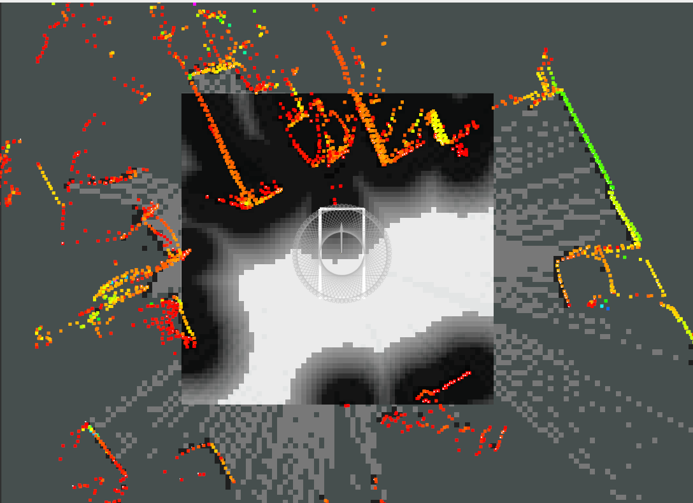
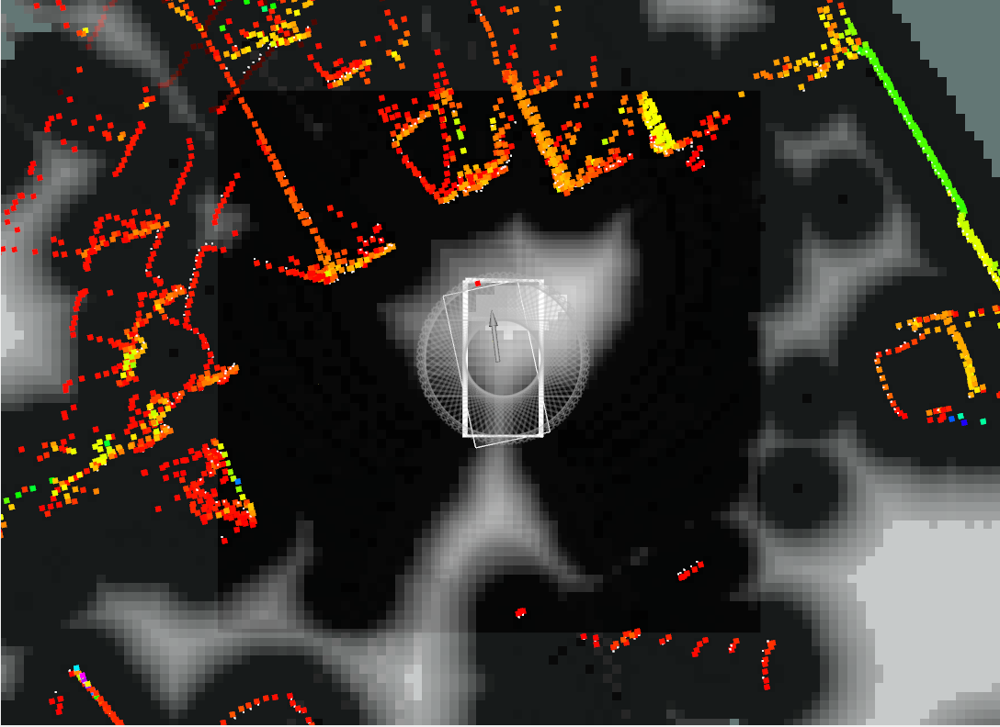
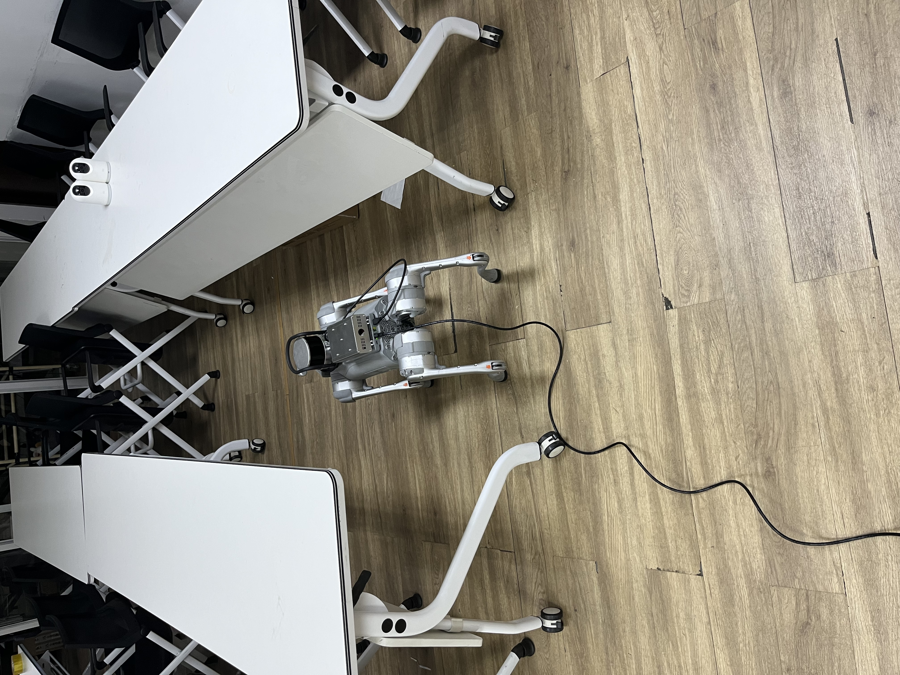

## 8.20

新开了一个账户：isee-pst

密码：Isee601pst

ubuntu 22.04

进行了中文输入法安装/typora安装/codex cli安装等开荒


### 代码迁移与分离

当前代码的依赖并不完整。主要问题分为：

  1. requirements.txt 声明不全。
  2. 当前 Python 环境没有安装大部分算法依赖。
  3. ROS2 Humble 已安装，但传感器、Go2、FAST-LIO 等 ROS 包缺失。
  4. 模型权重、Habitat 数据和外部工作区缺失。

  #### 1. 当前 Python 环境实测缺失

  即使 source /opt/ros/humble/setup.bash 后，下面这些仍然缺失：

   缺失模块          对应安装包                   用途
  ━━━━━━━━━━━━━━━━  ━━━━━━━━━━━━━━━━━━━━━━━━━━━  ━━━━━━━━━━━━━━━━━━━━━━━
   torch             torch                        推理、CUDA
  ────────────────  ───────────────────────────  ───────────────────────
   torchvision       torchvision                  YOLO/SAM 依赖
  ────────────────  ───────────────────────────  ───────────────────────
   open3d            open3d                       点云建图、ICP、可视化
  ────────────────  ───────────────────────────  ───────────────────────
   skimage           scikit-image                 地图形态学、frontier
  ────────────────  ───────────────────────────  ───────────────────────
   skfmm             scikit-fmm                   FMM 路径规划
  ────────────────  ───────────────────────────  ───────────────────────
   ultralytics       ultralytics                  YOLO-World、MobileSAM
  ────────────────  ───────────────────────────  ───────────────────────
   supervision       supervision==0.19.0          检测结果封装和显示
  ────────────────  ───────────────────────────  ───────────────────────
   openai            openai                       GPT-4o frontier 分配
  ────────────────  ───────────────────────────  ───────────────────────
   zmq               pyzmq                        原有 Go2 ZMQ 控制
  ────────────────  ───────────────────────────  ───────────────────────
   omegaconf         omegaconf/hydra-core         配置对象
  ────────────────  ───────────────────────────  ───────────────────────
   yacs              yacs                         Habitat/VLM 配置
  ────────────────  ───────────────────────────  ───────────────────────
   quaternion        numpy-quaternion             仿真姿态变换
  ────────────────  ───────────────────────────  ───────────────────────
   habitat           修改版 habitat-lab==0.2.1    Habitat 仿真
  ────────────────  ───────────────────────────  ───────────────────────
   habitat_sim       habitat-sim==0.2.1           Habitat 模拟器
  ────────────────  ───────────────────────────  ───────────────────────
   unitree_sdk2py    Unitree SDK2 Python          Python Go2 速度桥

  当前已经存在的通用包包括 numpy、opencv-python、Pillow、PyYAML、requests、scipy。

  #### 2. requirements.txt 漏掉的 Python 依赖

  当前 requirements.txt:1 没有声明以下直接依赖：

  torch
  torchvision
  opencv-python
  Pillow
  PyYAML
  requests
  pyzmq
  scipy
  yacs
  numpy-quaternion

  其中：

  - torch、torchvision 在 README 里要求用 conda 安装，但没有纳入统一环境文件。
  - numpy-quaternion 在 README 真机章节提到。
  - pyzmq、yacs、scipy 等既被代码直接导入，又没有可靠地写进安装清单。
  - omegaconf 通常由已声明的 hydra-core 间接安装，但最好显式声明。

  因此，仅执行：

  pip install -r requirements.txt

  不足以运行代码。

  #### 3. ROS2 依赖情况

  当前机器存在 /opt/ros/humble。source 后，以下基础 ROS 模块可用：

  - rclpy
  - tf2_ros
  - tf_transformations
  - message_filters
  - sensor_msgs
  - sensor_msgs_py
  - geometry_msgs
  - std_msgs
  - rviz2
  - launch_ros

  但以下项目相关 ROS 包不存在：

   缺失项                    用途
  ━━━━━━━━━━━━━━━━━━━━━━━━  ━━━━━━━━━━━━━━━━━━━━━━━━━━━━━━
   spark_fast_lio            UTLiDAR/Hesai 激光惯性里程计
  ────────────────────────  ──────────────────────────────
   hesai_ros_driver          Hesai XT16 驱动
  ────────────────────────  ──────────────────────────────
   realsense2_camera         RealSense D455 RGB-D 驱动
  ────────────────────────  ──────────────────────────────
   realsense2_description    RealSense TF/描述
  ────────────────────────  ──────────────────────────────
   unitree_go                Go2 ROS2 消息
  ────────────────────────  ──────────────────────────────
   unitree_api               Unitree API 消息
  ────────────────────────  ──────────────────────────────
   unitree_ros2_example      当前脚本使用的 C++ 速度桥

  所以 ROS2 本身不是主要缺口，缺的是机器人、相机、雷达和定位功能包。

  #### 4. 缺失的模型权重

  代码直接加载：

  - mobile_sam.pt
  - yolov8l-world.pt

  加载位置在 utils/detection_segmentation.py:40。

  当前仓库中两者都不存在。Ultralytics 在联网环境下可能自动下载，但真机离线运行时必须提前准备权重，最好使用绝对路径或配置参数。

  #### 5. 缺失的仿真数据和修改代码

  当前不存在：

  data/
  multi-robot-setting/

  仿真配置要求：

  - HM3D 场景数据。
  - ObjectNav HM3D v2 episode 数据。
  - 或 Gibson ObjectNav 数据。
  - 修改过的多机器人 Habitat。

  具体路径见 configs/multi_objectnav_hm3d.yaml:32。

  README 要求复制 multi-robot-setting/habitat，但该目录当前已不在仓库中，因此原始 habitat-lab==0.2.1 即使安装成功，也不一定支持这里的多机器人配置。

6. #### 缺失的外部工作区和脚本

  启动脚本期望以下路径存在，但当前均缺失：

  ~/venv/co-nav-real/bin/activate
  ~/Documents/liang/fastlio2_ws/install/setup.bash
  ~/Documents/liang/hesai_xt16_ws/install/setup.bash

  ../setup_connect.sh
  ../odom_to_tf.py
  ../install/unitree_ros2_example/bin/twist_to_go2_sport_bridge

  例如 start_ros_single_nav_spark_fastlio.sh:38 会直接检查这些文件，缺少任何一个都会退出。

  当前系统也只有 python3，没有 python 命令；三个启动脚本最后使用的是 python ros_single_nav.py。预期虚拟环境缺失时，这里也会失败。

  #### 7. 环境配置缺失

  当前未设置：

  OPENAI_API_KEY

  这会影响：

  - main.py
  - main_vec.py
  - ros_multi_nav.py

  因为 utils/chat_utils.py:16 在导入模块时就创建 OpenAI() 客户端。单机 ros_single_nav.py 不使用 GPT 分配，理论上不需要该 Key。

  ### 按运行目标划分

  #### 只运行单机 Go2 导航，至少还缺

  torch torchvision open3d scikit-image scikit-fmm
  ultralytics supervision pyzmq yacs numpy-quaternion
  spark_fast_lio 或 odom_to_tf
  RealSense ROS2 驱动
  Unitree 控制桥
  mobile_sam.pt
  yolov8l-world.pt

  #### 运行双机真机导航，还需要

  openai
  OPENAI_API_KEY
  两套机器人/传感器 ROS namespace
  双机 TF 配准
  两台机器人 ZMQ 或 ROS 控制桥

  #### 运行 Habitat 仿真，还需要

  habitat-sim==0.2.1
  habitat-lab==0.2.1
  修改版多机器人 habitat
  HM3D/Gibson 数据
  OpenAI API Key

  总体上，当前最优先补齐的是统一 Python 环境、模型权重、RealSense/Unitree ROS 包，以及 SPARK-FAST-LIO 工作区。

# 8.21

环境迁移与构建

环境已构建完成，位置：

```txt
  /home/isee-pst/venv/co-nav-real
```

  激活方式：

```bash
  source /opt/ros/humble/setup.bash
  source /home/isee-pst/venv/co-nav-real/bin/activate
```

  验证结果：

  - Python 3.10.12
  - PyTorch 2.7.1+cu118 / torchvision 0.22.1+cu118
  - RTX 4060、CUDA 可用
  - ROS Humble 与 ROS Python import 通过
  - Open3D 0.19.0、OpenCV 4.11、Ultralytics 8.4.41、Supervision 0.19.0
  - Co-NavGPT2/ros_single_nav.py import 通过
  - 未安装 OpenCV-headless、OpenAI、Habitat、unitree_sdk2py、torchaudio
  - 仓库及标准缓存中未发现模型权重
  - 环境占用 7.3 GiB，磁盘剩余约 17 GiB
  - 仓库没有产生修改

  当前限制：

  - pip check 仅有预期警告：Supervision 元数据要求 opencv-python-headless。为避
    免双 OpenCV 冲突，实际只保留 opencv-python。

  - Matplotlib 3D 会因系统包与 venv 包混用产生警告，不影响当前 Co-Nav/Open3D 导
    航入口。

  - 下列真机前置文件目前缺失，因此暂时不能执行 Co-NavGPT2/
    start_ros_single_nav_spark_fastlio.sh：
      - setup_connect.sh
      - twist_to_go2_sport_bridge
      - odom_to_tf.py
      - FAST-LIO 工作区的 install/setup.bash

  - 当前源码实例化节点会加载 YOLO/SAM；API 感知改造完成前不要运行真机入口。

## 8.24

配置了无需密钥的远程连接

```
ssh-keygen -t ed25519 -f ~/.ssh/unitree_go_ed25519 -C "unitree-go"
```

产生

```~/.ssh/unitree_go_ed25519
~/.ssh/unitree_go_ed25519（私钥，绝对不要发给别人或提交到 GitHub)
~/.ssh/unitree_go_ed25519.pub(可以复制到机器人的公钥)
```

在~/.ssh/config下写入了配置

```Host unitree-go
    HostName 192.168.123.18
    User unitree
    IdentityFile ~/.ssh/unitree_go_ed25519
    IdentitiesOnly yes
```

#### 以后远程连接执行

```
ssh unitree-go
```

## 8.25

官方版本证据发现了一个明确不一致点：realsense-ros 4.55.1 的官方 CMake 请求 realsense2 2.55.1，而 Go2 节点实际打印“Built/Running with 2.53.1”；同时当前
  D435 固件 5.12.7.150 低于 librealsense 2.53.1 release 推荐的 D400 5.14.0.0+。这两项都可能解释 USB/SCP 异常，但尚不能因此直接升级。

rgb与depth频率降低为15FPS后错配情况变好

```
60秒实测结果：

  - Go2本机 aligned-depth：14.23 Hz，达到配置值的94.9%。
  - 60秒窗口约821帧。
  - 稳态未再次出现USB SCP overflow。
  - 启动阶段仍有libusb warning。
  - 最长偶发间隔约368 ms。
  - 跨机RGB-D配对median为0，最大错配135 ms；超过运行时100 ms门槛的帧对会被拒绝。
```

相机启动命令

```bash
ros2 launch realsense2_camera rs_launch.py \
    depth_module.depth_profile:=640x480x15 \
    rgb_camera.color_profile:=640x480x15 \
    enable_sync:=true \
    align_depth.enable:=true
```

imu消息的header.stamp比主机时间快约ms（后续测试中为30+ms），但lidar与imu时间戳较为一致，理论上不影响fasltio,所以暂时先不管。

## 8.27

今天遇到一个令人困惑的问题，根据里程计对静止漂移的修正，认为发布/utlidar到SPARK FASTLIO的雷达没有旋转，即朝向为正；而话题名字则指向宇树自研的雷达Unitree 4D Lidar而非livox或者禾塞的XT16雷达。根据机器狗的官方手册，机器狗的头部的雷达为宇树自研雷达，而狗背上的雷达按照图片所示是禾塞的雷达朝向是正的，而机器狗头部的雷达朝向斜下方是有旋转的。存在矛盾，即不知道发布/utlidar的雷达究竟是哪一个，如果是机器狗头上的雷达，则理应存在位姿的旋转，按照有旋转的外参才能修正静止漂移；如果是机器狗背上的雷达，则话题名称看起来不是很相符。关键是，机器狗身上尽管装有两个雷达，但是ros2话题中只能找到一个雷达发布的话题。

为了确认雷达的外参和xyz方向，我们目前人工观察点云，使用unitree_ros2/log里面的单帧查看器查看单帧点云，并用外参调试器手动估计外参。目前发现最大嫌疑是“地面”的最大平面，是倾斜且位于z+方向区域内的，因此看起来坐标的z+方向大致朝下；又对墙壁走近，从而找到一个距离明显变近的平整平面，然后确定正方向。目前进行手工估计，旋转参数为[0.16, 3.25, 2.2]


## 8.28

真机 Gate 2 里，**60 秒静止漂移**是：

- 平移漂移：**0.482726489 m**
- 航向漂移：**-2.784416°**

当时设的验收阈值是：

- 平移：**< 0.05 m / 60 s**
- yaw：**< 2° / 60 s**

当前使用的参数来自官方文档：

```
# LiDAR -> internal IMU
extrinsic_T:
  [0.007698, 0.014655, -0.00667]

extrinsic_R:
  [1,0,0,
   0,1,0,
   0,0,1]

extrinsic_est_en: false
```

```
Unitree URDF nominal:

base → radar
xyz = [0.28945, 0, -0.046825]
rpy = [0, 2.8782, 0]
```

#### 现在的核心问题是Go2 + Unitree L2 + SPARK-FAST-LIO 在机器狗静止时，odometry 会出现明显位置漂移，导致 Gate 2 无法通过。启动阶段有较大的收敛瞬态，之后还有一段低频位置游走。

已经排查过的东西，可以先分成“基本排除”和“还没定论”。

- **LiDAR/IMU 硬件明显故障：目前不支持。** `/utlidar/cloud` 约 15.4 Hz，点数约 4k/frame；IMU 约 249 Hz，加速度模长接近 9.81，NaN/Inf、时间戳回退等都没发现明显异常。
- **point-level timestamp 单位错误：基本排除。** L2 点内 `time` 范围约 63 ms，与约 65 ms 的帧周期一致；SPARK 中把它转成 curvature(ms) 的路径基本正确。那个 “expected 100 ms” warning 更像写死了 10 Hz 假设。
- **L2 LiDAR→IMU 外参明显错误：目前低优先级。** 当前用的是 Unitree L2 官方 nominal：`T=[0.007698, 0.014655, -0.00667], R=I`。
- **IMU 初始化样本太少：不是主要根因。** `MAX_INI_COUNT 10→100` 没稳定改善，不能解释后续问题。
- **gyro bias 本身很大：排除。** raw gyro bias 只有约 `6e-4 rad/s` 量级。
- **之前出现的 bg 发散：不是稳定可复现现象。** 有一轮 bg 曾跑到很离谱，但最近完整 65 秒测试中 bg 基本正常，没有发散。
- **No Effective Points 是稳定根因：也暂时排除。** 最近 999 帧中，正式 odometry 阶段没有出现 `effective=0`，`No Effective Points` 也没有复现。

现在剩下最值得怀疑的是：

> **LiDAR 给 FAST-LIO 的几何约束可能偏弱或存在退化。**

#### 最终打算：使用HESAI XT16雷达，虽然今天才兴奋地拆掉，但好像还是得装上


## 8.29

#### Go2 上位机里已经有现成的 XT16 驱动，暂时完全没必要再安装 Hesai 官方 ROS 2 驱动，且 明确按 `192.168.123.20` 配置 XT16，并把点云发布到 `rt/unitree/slam_lidar/points`

找到的是：

```
/home/unitree/liang/unitree/module/unitree_slam/bin/xt16_driver
```

而且它是：

```
ARM aarch64
dynamically linked
可执行
1.5 MB
```

这正适合 Go2 上位机的 ARM 环境。旁边还同时存在：

```
mid360_driver
xt16_driver
unitree_slam
keyDemo
```

这很像一套完整的 Unitree SLAM/外接雷达运行环境，而不是偶然留下的单个文件。

这里还有个值得记住的参数：

```
pose_imu_lidar:
  [0.707, 0.0, 0.0, 0.707, 0.1710, 0.0, 0.0908]
```

注释已经说明格式是：

```
[qw, qx, qy, qz, tx, ty, tz]
```

这显然是这套 Unitree XT16 SLAM 使用的 IMU→LiDAR 外参。先别改它，以后接 FAST-LIO 时可能很有参考价值。

#### 架构确认为

```
XT16
192.168.123.20
       │
       │ Ethernet / UDP
       ▼
Go2 上位机 eth0
192.168.123.18
       │
       ▼
./xt16_driver
       │
       │ CycloneDDS
       ▼
rt/unitree/slam_lidar/points
       │
       ▼
unitree_slam
```

现在有两套方案，戈畅采用方案B,虽然不知道什么原因，且好像配置文件完全没找到，可能被删了，但我们也还是用方案B罢。

### 方案 A：Unitree 原生方案

```
XT16
 ↓
Go2 上位机 xt16_driver
 ↓
rt/unitree/slam_lidar/points
 ↓
Unitree SLAM
```

优点是现成、无需安装。

### 方案 B：你们自己的 Humble 算法方案

```
XT16
 ↓
你的 Ubuntu 22.04
 ↓
Hesai ROS2 driver
 ↓
/lidar_points
 ↓
FAST-LIO
```

## 进度：**Hesai ROS 2 驱动已经完整安装成功**：

```
package:    hesai_ros_driver
executable: hesai_ros_driver_node
```

SPARK-FAST-LIO 的 XT16 launch 已经能够正常启动

### 现在的软件链已经走到这里

```
XT16
 ↓
hesai_ros_driver                 ✓
 ↓ /lidar_points
hesai_to_fastlio.py              ✓
 ↓ /lidar_points_fastlio
SPARK-FAST-LIO                   ✓ 能正常启动
 ↓
/odometry
/cloud_registered_base
```

但最后两项还不能验证，因为 XT16 当前没有真实点云。

#### ！！！XT16似乎没法启动，不知道是接线问题还是什么问题-----因为没运行驱动

#### 进度总结：

1. **如果学姐确实用的是 XT16 自己的 IMU，那么我也更倾向于优先复刻她的方案。** 逻辑上确实更顺：LiDAR 和 IMU 来自同一设备，时间体系更容易一致，也少了一层“XT16 点云 + Unitree L2 IMU”的跨设备同步问题。不过现在只能说“很可能”，还不能确认。我们下周第一件事之一就是验证 `/lidar_imu` 是否真实发布、频率/时间戳/QoS/数据是否正常。Codex 的分析也明确把 IMU 来源列为未确认项，不能仅因为 Hesai 配置里有 `/lidar_imu` 就假设 XT16 一定能提供可用 IMU。

如果确认可用，改动其实**不麻烦**，核心就是把：

```
/utlidar/imu
```

换成：

```
/lidar_imu
```

同时修改 `imu_frame`，并给 FAST-LIO 配正确的 **LiDAR↔IMU 外参**。真正麻烦的不是改代码，而是确认这组外参和时间语义。若 XT16 的 IMU 是雷达内部 IMU，反而可能比“XT16 + L2 IMU”更好处理，但不能直接假设 `extrinsic_T=[0,0,0]`、`R=I`。

1. **对，目前还没有把 `spark_fast_lio_go2_xt16.launch.yaml` 正式迁移进 VLM_Nav。** 我们现在只是拿 `Co-NavGPT2` 里的旧 XT16 launch 做了 plumbing test，证明 `spark_lio_mapping` 能启动、`hesai_lidar` frame 能被找到。VLM_Nav 的正式 Go2 链目前仍然写死 `/utlidar/cloud`、`/utlidar/imu` 和 `utlidar_lidar`。

所以现在状态是：

```
Co-NavGPT2:
XT16 reference launch/config   ✓ 可用作模板

VLM_Nav:
正式 XT16 integration         ✗ 还没做
```

这其实是好事——我们还没有在参数没测清之前污染正式工程。

1. **下周回来建议严格按这个顺序走：**

- 先解决 XT16 供电/网络，确认 `192.168.123.20` 真正在线。
- 启动 `hesai_ros_driver`，实测 `/lidar_points`；同时确认 `/lidar_imu` 是否真实存在、频率、frame、时间戳、QoS。
- 如果 XT16 IMU 可用且行为正常，优先选 `/lidar_imu`；否则退回 `/utlidar/imu`。
- 启动 converter，验证 `/lidar_points_fastlio` 的字段确实是 `x y z intensity time ring`，并检查 `ring=0..15`、scan rate、点内时间跨度、是否有大量 `time=0`。converter 与当前 Hesai 输出在字段结构上已经确认兼容。
- 单独跑 `XT16 + 选定 IMU + SPARK-FAST-LIO`，先验证数据流和时间，不接 SLAM/Nav2。
- 确定两类外参：`base_link -> hesai_lidar` 和 FAST-LIO 内部 `LiDAR ↔ IMU`。这是当前最明确的 blocker。
- 这些都稳定后，再把 XT16 launch/config 正式迁入 VLM_Nav，修改 `go2_system.launch.py`、`spark_fast_lio_go2.yaml`、preflight、safety supervisor、Nav2 sensor frame 等；FAST-LIO 后面的 `/odometry -> /cloud_registered_base -> obstacle filter -> /scan -> SLAM Toolbox -> Nav2/VLM_Nav` 尽量保持不动。

直接从：

> **“XT16 已重新装好 Hesai driver，converter 和 SPARK plumbing 均通过；下一步先验证真实 XT16 点云和 XT16 自带 IMU。”**

这里继续即可。

# 8.31

统一网段下的电脑直接开下面地址的会看到hesai的页面，应该是连上了

```txt
http://192.168.123.20
```


### 查看狗嘴上的雷达IMU /utlidar/imu：

查看狗嘴上雷达的imu输出，在**ssh连接**的终端输入

```bash
ros2 topic info -v /utlidar/imu
ros2 topic hz /utlidar/imu
```

或者在**没有进行ssh连接**的终端放下面的命令来查看

```bash
source /opt/ros/humble/setup.bash
source ~/unitree_ros2/go2_ws/install/setup.bash
export GO2_NET_IFACE=enp4s0
source ~/unitree_ros2/VLM_Nav/scripts/go2_network_env.sh
# 用下面这个来检测
timeout 10 ros2 topic hz /utlidar/imu
```

可以观察到/utlidar/imu的频率输出平均250Hz

### 开启狗背上雷达的驱动并检查：

而狗背上的雷达**启动驱动**：在**没有ssh连接**的终端输入并放置它一直输出

```bash
# 下面的是启动和检测都要用的命令
source /opt/ros/humble/setup.bash
source /home/isee-pst/Documents/liang/hesai_xt16_ws/install/setup.bash
source ~/unitree_ros2/go2_ws/install/setup.bash
export GO2_NET_IFACE=enp4s0
source ~/unitree_ros2/VLM_Nav/scripts/go2_network_env.sh
export ROS_LOG_DIR=/tmp/hesai_roslog

# 启动驱动
ros2 run hesai_ros_driver hesai_ros_driver_node \
--ros-args \
-p config_path:=/home/isee-pst/Documents/liang/hesai_xt16_ws/src/HesaiLidar_ROS_2.0/config/config.yaml

# 检查发布数
ros2 topic info --no-daemon -v /lidar_points
# 预期发布数为1
# 据说ros2 topic hz 不输出的原因是：ROS 2 Humble 的 topic hz 固定使用 sensor_data QoS，而 Hesai publisher 使用：
# RELIABLE + VOLATILE
# 在当前 CycloneDDS 环境下，hz 没有成功接收这种大尺寸 PointCloud2。
```

发现狗背雷达的点云/lidar_points和狗嘴的雷达IMU /utlidar/imu可用，现在计算外参

完成 XT16 converter 阶段，新增 C++ converter：go2_ws/src/hesai_fastlio_converter

```
  - 输入：/lidar_points
  - 输出：/lidar_points_fastlio
  - QoS：RELIABLE，KEEP_LAST(1)
  - 单槽 latest-frame 策略，主动丢弃旧帧，避免积压
  - 丢弃不完整帧、乱序帧、非法时间和异常 ring 分布
  - header.stamp 原样继承，不调用 now()
```

输出字段已实测为：

  x y z intensity time ring

  最终现场 gate

```
  - Hesai 原始帧大部分为 64000 点
  - converter 持续接收约 10 Hz
  - 输出约 9.6 Hz，属于主动丢弃旧帧后的近 10 Hz
  - 转换耗时约 54–56 ms
```

  已接入：

  - Co-NavGPT2/start_ros_single_nav_hesai_fastlio.sh

  - VLM_Nav/scripts/measure_hesai_fastlio_converter.py

    

已验证 XT16 + /utlidar/imu + SPARK FAST-LIO，结果通过

# 9.1

#### 在余豪那边的帐号使用edge进入宇树网站联系工程师，那里登陆了李亮师兄的帐号，可以与售后进行交流。本机的SN码为 B42D4000PBAC9141 ,查看方法是拔出电池看里面。

- [ ] 即便使用了前面的驱动命令，仍无法在终端中观察`ros2 topic hz /lidar_points`依然没有看到输出，只有在连接ssh的终端才有。用codex排查不出，codex说是能通过前面那些环境观测到输出的，但是自己在命令行却没有看到输出。这个不太重要，不管了

开启converter的命令

```bash
# 狗背6条命令

ros2 run hesai_fastlio_converter hesai_fastlio_converter_node \
--ros-args \
-p input_topic:=/lidar_points \
-p output_topic:=/lidar_points_fastlio \
-p input_reliability:=reliable \
-p output_reliability:=reliable \
-p expected_points:=64000 \
-p min_points:=60000 \
-p scan_lines:=16 \
-p min_scan_period_sec:=0.05 \
-p max_scan_period_sec:=0.15 \
-p min_points_per_ring:=3000 \
-p input_time_field:=timestamp
```

目前需要修改两个地方：

1. LiDAR 时间为什么旧 2～5 秒？(/lidar_points和/lidar_points_fastlio的stamp - system_now，中位数-2.5s)基本可以排除 XT16 设备时钟、Hesai driver 固定延迟、converter 自身持续积压和 SPARK 单帧计算太慢。剩主要是“联合运行时的 ROS2/DDS/调度滞后”与“诊断观测本身滞后”这两类。
2. 修 SPARK odometry 单一发布策略

# 9.2

宇树工程师说雷达的IMU不准确，可以使用狗机体的IMU,订阅话题**/lowstate**来获取。

>  **Lidar时间慢的原因是，Hesai SDK 自己像一个仓库，UDP 包不断往仓库origin_packets_buffer_里塞，但负责“拆包、组帧、转成 ROS 点云并发布”的那个工人处理不过来，于是仓库越堆越多**

现在把诊断器订阅raw frame的高负载去除就解决了。

QoS指的是生产者和消费者约定的规则。Quality of Service，服务质量策略。在 ROS 2 里，它决定一个 topic 的消息要“怎么发、怎么收、丢不丢、排多少、要不要保证送到”。


Gate 3 原本主要卡在两处。第一处是 CycloneDDS 对大体积 /cloud_registered_base 点云的接收缓冲区过小，导致单个 typed PointCloud2 subscriber 在约 2.87 MB、9.5 Hz 数据下完全收不到消息，/wait_go2_fastlio 因此一直停在 0/3，无法通过 readiness。通过将 Linux net.core.rmem_max 提高到 16 MiB，并在 cyclonedds_go2.xml 中设置 \<SocketReceiveBufferSize min="16MiB"/\>，单 typed reader 恢复到完整接收，CycloneDDS blocker 被关闭。

第二处是在恢复正式 staged launch 后，hesai_fastlio_converter 因输入 QoS 参数错误退出。正式 launch 将 input_reliability 配成了 reliable，但 converter 的既定 contract 要求输入为 best_effort、输出为 reliable。将 VLM_Nav/launch/go2_system.launch.py 中 converter 的输入 reliability 改为 best_effort 后，converter 恢复稳定输出，FAST-LIO 约 10 Hz 运行，/wait_go2_fastlio 在 0.898 s 内完成 1/3 → 2/3 → 3/3 并以 exit code 0 退出，staged launch 随后正常启动 obstacle_cloud_filter。最终 odom/TF 均约 10 Hz，rollback/duplicate 为 0，Bridge 保持 dry-run、DISARMED，因此 Gate 3 最终通过并可关闭。

现在来到gate5, 发现有异常帧偶发重力小于9.6m/s^{-2}

现在让机器狗趴着和站着各进行60s测量，突然机器狗直接跌倒了，然后趁机测了一下（此时机器狗嘴上的雷达在尝试转动但是卡住）

```txt
状态           Mean        Std       P0.1         P1        Min       <9.6    最长连续
━━━━━━━━━━  ━━━━━━━━━  ━━━━━━━━━  ━━━━━━━━━  ━━━━━━━━━  ━━━━━━━━━  ━━━━━━  ━━━━━━━━━━
初始静止    9.80677    0.04740    9.65134    9.69449    9.62301       0           0
──────────  ─────────  ─────────  ─────────  ─────────  ─────────  ──────  ──────────
站立        9.82728    0.05758    9.64089    9.68910    9.57929       2           1
──────────  ─────────  ─────────  ─────────  ─────────  ─────────  ──────  ──────────
倒地        9.81445    0.03766    9.61282    9.69944    9.45111      10           2

```

现在尝试换机器狗身体的IMU

### 查看机器狗机体的IMU

```bash
source /opt/ros/humble/setup.bash
source /home/isee-pst/unitree_ros2/go2_ws/install/setup.bash
source /home/isee-pst/unitree_ros2/VLM_Nav/scripts/go2_network_env.sh

# 看 /lowstate 是否存在
ros2 topic list | grep lowstate

# 看消息类型
ros2 topic type /lowstate

# 看 publisher、QoS 等
ros2 topic info /lowstate -v

# 看频率（观测到平均500Hz）
ros2 topic hz /lowstate

# 完整消息查看
ros2 topic echo /lowstate
```

Adapter 已完成：

  - VLM_Nav/src/lowstate_imu_adapter.cpp：/lowstate → /body_imu
  - 输出类型：sensor_msgs/msg/Imu
  - Frame：body_imu
  - 输出 QoS：RELIABLE / VOLATILE / depth 50
  - quaternion 正确转换 [qw,qx,qy,qz] → x,y,z,w
  - 时间戳暂用主机 callback receipt ROS time；不猜测未文档化的 tick

  验证结果：

  /body_imu ≈497–500 Hz
  publisher count=1

  运行命令：

```bash
 ros2 run vlm_nav lowstate_imu_adapter
```

  当前未接入 SPARK；需先完成 body IMU 时间对齐与 hesai_lidar → body_imu 外参验证。


## 9.3

有一个小问题值得记一下：

```
静止 /lidar_points_fastlio ≈ 6.1 Hz
```

与：

```
/odometry ≈ 10 Hz
```

以及动态：

```
436 samples / 45 s ≈ 9.69 Hz
```

#### 遇到一个问题：实际手动操作让go旋转大角度，但最终结果上yaw只有零点零几，排除了直接把rad当degree的可能

目前最关键的逻辑证据已经是：

```
真实 yaw：约 180–270°
      ↓
/body_imu ∫wz：235°
      ↓
FAST-LIO /odometry：约 0°
```

说是此前 `0.888° / 0.297°` 更可能是**采集窗口/实验同步问题**，因为再一次验证之后能正常记录了。

spark_fast_lio中body_imu-hesai_lidar的T好像符号反了，已修改。

 gate2发现重力加速度的mean<9.6,因此认为9.6是旧gate2指标，不适用与现在的情况。

 body IMU：

```
|a| mean ≈ 9.598
P1       ≈ 9.527
min      ≈ 9.503
```

### gate5 pass，可以回头做一个最后试验

进行前进，后退，左右转各十秒的测试， 观察发现，前进约4秒，然后一直后退且没能停止，到了左右旋转的阶段仍在退后。第二次仅测试旋转，观察到其确实按要求慢速旋转了逆时针和顺时针各一段时间。最终停止运动。

此前测试中出现的 publisher 生命周期污染、SYSTEM_READY watchdog 状态衔接以及 Sport recorder 漏观测问题均已单独定位，不再构成本 Gate blocker。最后一段 StopMove 没有落进 recorder 窗口，将其补齐就行。明天**再次进行前后移动和旋转测试， 最后确定gate5即可pass**！

## 9.4

进行一个小的Nav验证，但NAV_READY = false，原因记录如下：

```
1.出现过Humble API调用错误，好像之前也出现过，需要注意
2.列出了NAV_READY的全部子条件和实际值以排查，哪里false排哪里。发现supervisor subscription 存在但未收到任何 nav2_msgs/msg/Costmap，NAV_READY 唯一失败条件 = costmap_fresh。
但subscriber与publisher的QoS完全兼容...
```

某个cycle一直在循环，但某个靠时间节点触发的为0,怀疑时间问题。把 blocker **完全定位清楚了**：

> **根因不是 costmap plugin、QoS、TF 或 supervisor，而是 Nav2 costmap 的时间源配置错误。**

现在是真机运行，但：

```
/local_costmap/local_costmap   use_sim_time=true
/global_costmap/global_costmap use_sim_time=true
```

同时：

```
/clock publisher = 0
ROS time = 0
```

于是两个 costmap 的 ROS 时间被冻结了


#### Another  问题：

发现有些有两个同名节点，停止所有进程后，graph 中同名节点仍持续存在：   

/controller_server             ×2  

/planner_server                ×2  

/bt_navigator                  ×2  

/local_costmap/local_costmap   ×2  

/global_costmap/global_costmap ×2  

/go2_nav_supervisor            ×2 

 /velocity_smoother             ×2  

/waypoint_follower             ×2  

/lifecycle_manager_navigation  ×2

现在定位每个节点的ip,看看是谁产生的

神秘。。

#### 根本原因是本机同时启动了两套独立的 VLM_Nav launch，而不是远端主机或 DDS 自动生成节点：

  1. 一套由：

  ros2 launch vlm_nav go2_system.launch.py target_stage:=nav2

  启动。

  2. 另一套由此前单独执行的：

  ros2 launch vlm_nav go2_navigation.launch.py

  启动。

  两套 launch 各自创建了完整 Nav2 栈，因此出现：

  - /controller_server ×2
  - /local_costmap/local_costmap ×2
  - /go2_nav_supervisor ×2
  - 两个不同 DDS participant/GID
  - 两组不同 UDP 端口

  进程树最终确认两套 participant 都来自本机、且属于旧 VLM_Nav/Go2 launch。并非远程 Docker，也不是 CycloneDDS 自行重复创
  建。

  停止两个父 launch 后，子进程全部退出；等待 DDS lease 清理并重置 CLI daemon 后，重复节点和 costmap publisher 均消失。

## Go2 启动文件关系

两者关系很简单：

| Launch                                    | 作用                    | 启动内容                                                     |
| ----------------------------------------- | ----------------------- | ------------------------------------------------------------ |
| `go2_system.launch.py target_stage:=nav2` | Go2 完整 staged bringup | 传感器、转换、IMU adapter、TF、FAST-LIO、readiness waiter、障碍物处理、LaserScan、SLAM，最后包含 Nav2 |
| `go2_navigation.launch.py`                | 独立 Nav2 启动文件      | 只启动 Nav2 节点和 `go2_nav_supervisor`                      |

### `go2_system.launch.py` 的阶段链

```
Hesai
→ converter
→ /body_imu adapter
→ FAST-LIO
→ obstacle filter
→ pointcloud_to_laserscan
→ SLAM Toolbox
→ go2_navigation.launch.py
```

当执行：

```
ros2 launch vlm_nav go2_system.launch.py target_stage:=nav2
```

在 SLAM readiness 通过后，`go2_system.launch.py` 会自动通过 `IncludeLaunchDescription` 加载：

```
go2_navigation.launch.py
```

因此，这条完整系统启动命令**已经包含了一套 Nav2**。

### 单独启动 Nav2

如果另外执行：

```
ros2 launch vlm_nav go2_navigation.launch.py
```

则会再次创建一套 Nav2 相关节点，包括：

```
controller_server
planner_server
bt_navigator
local_costmap
global_costmap
velocity_smoother
lifecycle_manager_navigation
go2_nav_supervisor
```

这会导致系统中出现重复的 Nav2 节点。

## 正式启动规则

正式运行时，两种启动方式只能二选一。

### 方式一：完整系统启动

```
ros2 launch vlm_nav go2_system.launch.py target_stage:=nav2
```

用于完整 Go2 导航系统 bringup。

此时**不要再单独启动** `go2_navigation.launch.py`。

### 方式二：仅调试 Nav2

```
ros2 launch vlm_nav go2_navigation.launch.py
```

适用于上游传感器、FAST-LIO、SLAM 等组件已经存在，只希望单独调试 Nav2 的情况。

## 之前重复节点的原因

之前出现重复 Nav2 节点的直接原因是：

```
go2_system.launch.py
    ↓
自动包含 go2_navigation.launch.py
    ↓
已经启动一套 Nav2

同时又手工执行

go2_navigation.launch.py
    ↓
再次启动一套 Nav2
```

因此形成了两套：

```
controller_server
planner_server
bt_navigator
local_costmap
global_costmap
...
```

同时运行。

**结论：**

> `go2_system.launch.py target_stage:=nav2` 已经包含 `go2_navigation.launch.py`，两者不能同时启动。

#### 为什么之前kill了进程还是有一样的节点


• 主要有三层原因叠加：

  1. 之前杀的是子进程，不是 launch 父进程。
     例如只杀 controller_server 或 python3，父级 ros2 launch 仍在运行，可能继续保留或重新启动子节点。

  2. 实际上存在两套独立 launch。
     之前只停止其中一套时，另一套仍会继续广播同名节点，所以看起来“节点还是一样”。

  3. 进程退出后 DDS 发现信息不会立即消失。
     CycloneDDS participant lease 需要一段时间过期；同时 ros2 daemon 也可能保留旧 graph 信息。因此短时间内 ros2 node list
     仍能看到已退出节点。

  这次是先找到并终止两个 launch 父进程：

  - go2_system.launch.py
  - go2_navigation.launch.py

再等待 DDS lease 清理并重置 daemon，之后节点和 /local_costmap/costmap_raw publisher 才全部消失。


局部代价地图有问题，将无障碍的空旷区域也认为有障碍。目测全局代价地图和SLAM建图没有问题。

  

注意到图中/scan的白点在呈涟漪年轮状分布，这些地方所经的位置被认为是障碍物。经人工观察知这是地面回波，高度为相对baselink[-0.28, -0.24]m, 将障碍物识别范围从baselink z > -0.35m改为 -0.2m后，清除了这些误认的障碍。当初-0.35m的标准是用卷尺初步测量结合机器狗手册判断的，考虑到雷达有微小的俯仰可能使两米左右位置的地面抬高，产生误认，这些误认的障碍未被清除所致。

使用rviz查看：

```bash
# 终端 1：

  cd /home/isee-pst/unitree_ros2
  source /opt/ros/humble/setup.bash
  source go2_ws/install/setup.bash
  source VLM_Nav/scripts/go2_network_env.sh
  ros2 run vlm_nav costmap_gradient_visualizer

#  终端 2：

  cd /home/isee-pst/unitree_ros2
  source /opt/ros/humble/setup.bash
  source go2_ws/install/setup.bash
  source VLM_Nav/scripts/go2_network_env.sh
  rviz2 -d "$(ros2 pkg prefix vlm_nav)/share/vlm_nav/config/go2_costmaps_gradient.rviz"
  
# 终端 1：启动代价地图彩色转换节点

  env -i \
    HOME=/home/isee-pst \
    USER=isee-pst \
    PATH=/usr/local/sbin:/usr/local/bin:/usr/sbin:/usr/bin:/sbin:/bin \
    /bin/bash --noprofile --norc -c '
  set -e
  source /opt/ros/humble/setup.bash
  cd /home/isee-pst/unitree_ros2/VLM_Nav
  source scripts/go2_network_env.sh
  export PYTHONPATH="$PWD:${PYTHONPATH:-}"
  exec /usr/bin/python3 scripts/costmap_gradient_visualizer
  '

# 终端 2：启动专用 RViz

  cd /home/isee-pst/unitree_ros2/VLM_Nav
  source scripts/common.sh
  source scripts/go2_network_env.sh

  ./scripts/start_rviz.sh \
    /home/isee-pst/unitree_ros2/VLM_Nav/config/go2_costmaps_gradient.rviz
```

狗自身形成假障碍点:

```txt
- 右侧：(0.15, -0.19, 0.083) m
- 左侧：(0.15, +0.19, 0.156) m
```

由于机器狗官方手册记录机器狗站立宽度0.31m, 当时将自身筛选宽度改为了[-0.18,0.18] m, 但其实仍然未排除狗腿的边缘，因此继续增大自裁剪宽度到[-0.25, 0.25]m。观测到建图的效果符合直观， 但是运动时IMU不是很稳定，有时会跳变。

观察到外参差了一个90度：当机器狗向前走的时候，在图中却不是向x+方向走的。怀疑雷达外参确实如早期的内容那样是有90度旋转的，将body_imu -> hesai_lidar旋转改为[0,0,1.570796]重试。对自动控制检查坐标变化和手动测试在rviz观测都符合预期。认为参数修正了。

disarm停车命令：

```bash
cd /home/isee-pst/unitree_ros2
source /opt/ros/humble/setup.bash
source /home/isee-pst/unitree_ros2/go2_ws/install/setup.bash
source /home/isee-pst/unitree_ros2/VLM_Nav/scripts/go2_network_env.sh
export ROS_LOG_DIR=/tmp/go2_manual_stop_log
ros2 service call \
/twist_to_go2_sport_bridge/disarm \
std_srvs/srv/Trigger "{}"
```

让机器狗向前以0.2m/s移动10s,最终移动**0.9m**

### 测试的时候把移动时间拉长一些，以观察明显现象！！！

Go2 已安全停止并 DISARMED。 SYSTEM_READY=true → 外部 traffic 静默 2.1 s → ARM 成功 → vx=0.20 持续 9.999 s → 本桥连续发布 API 1008 → 所有 response status.code=0 → mode 始终为 0，未进入 3 → odometry 显示前向移动 → StopMove 1003 → DISARM

- 控制命令确实从本项目发到了 Go2；

- Go2 Sport 服务接受了这些 Move 请求；

- 机器人实际上执行了运动。


# 9.5

把preflight减到30s,有效600s

使用nomachine：

先打开nomachine

```bash
# 在这个电脑上
ssh unitree-go

# 连上机器狗以后在里面
sh nomachine.sh
```

然后打开nomachine就能看到连上了。在里面可以看realsense-viewer.

nav2选点逆时针旋转和移动没问题，成功了一次。顺时针转体有问题，太慢而且没有明显动作。


go面前有椅子和桌子，现实情况明显有余量，可以自由旋转，但图上似乎认为已经十分危险。这次实验也确实显示status 6,没有有效路径



改了cost_scaling_factor: 5.0 让代价下降得更快。但似乎有孤立障碍点在干扰，闪了很久



但是把go开走之后这个孤立障碍点消失，开回原来的位置之后障碍点也没有出现，像是偶发性的，所以还是先不再叠加过滤层。

nav2手动选点测试见`VLM_Nav/docs`

**手动选点nav2取得突破**：因为nav2给机器狗发送过小的速度和角速度导致电机无法正确执行，只会让机器狗伸展或扭动到一个状态就不动了，无法累计产生有效位移和角度。所以设置最低线速度0.4m/s和角速度0.5rad/s,并让它产生的候选速度和角速度需要满足这区域才行。

目前手动选点成功率从1/3提到2/3, 尚有footprint过大和受到空中雷达回波的问题，在距离障碍约15cm处已经不敢转体了。

# 9.7

记录一下录点云包的方法，保存到`~/unitree_ros2/log`,

```bash
sudo timeout --signal=INT 30s tcpdump -i enp4s0 -s 0 -B 4096 \
    -w ~/unitree_ros2/log/hesai_$(date +%Y%m%d_%H%M%S).pcap \
    'udp port 2368'
```

这个包用禾塞的pandarview查看。此电脑是ubuntu22.04，没有支持它的版本。

发现机器狗利用点云规划的nav2避障有问题，它忽视了后面趴着的另一只机器狗，撞在它背上了。机器狗好像变快了，以至于0.4m/s的速度行进十秒都会从第一排桌子一直走到几乎撞上601正门的墙上。将测试的行进缩减为6s, 且在电信院重新进行了测试。

试图将手动选点测试做成脚本，目前遇到了遗留节点的问题。


## 9.8

不知道为什么，运行脚本之后显示收不到lidar点云

how come

```
isee-pst@isee-Legion-R9000P-ARX8:~$ cd /home/isee-pst/unitree_ros2
  ./VLM_Nav/scripts/manualnav2.sh

Go2 DDS interface: enp4s0
Running 30-second formal preflight...
Go2 DDS interface: enp4s0
Starting temporary XT16 driver and Go2 body-IMU adapter...
Both sensor topics are ready. Keep Go2 stationary for 30 seconds.
{
  "cloud_errors": [],
  "error": "no valid LiDAR or IMU samples",
  "healthy": false
}
Session logs: /tmp/manualnav2.vEk2w8

```

啧.....雷达的某根线没接好

codex提供了初步的VLM_Nav启动顺序，见Notes/VLM_Nav初步启动指引.md

以及要在go的上位机开启相机驱动这边才能收到相机消息


#### 最初显示没有 RGB，原因是：

  - D435 实际连接在 Go 上位机，而不是笔记本。
  - realsense-viewer 只是直接读取 USB 画面，不会发布 ROS 2 图像。
  - 当时 Go 上位机没有运行 realsense2_camera，只有 /pctoimage_local，它不是 VLM 所需的 RGB 图像。
  - 笔记本的 enp4s0 还曾断开，失去了 192.168.123.x 地址，无法跨机接收 DDS 数据。
  - 笔记本本地运行 01_camera.sh 没用，因为相机不接在笔记本上。

  #### 正确操作如下。

  在 Go 上位机关闭 realsense-viewer，然后启动 ROS 相机驱动：

```
  ssh unitree-go

  source /opt/ros/foxy/setup.bash
  source ~/ros2_ws/install/setup.bash
  export ROS_DOMAIN_ID=0
  export RMW_IMPLEMENTATION=rmw_cyclonedds_cpp
  export ROS_LOG_DIR=/tmp/realsense_roslog
  mkdir -p "$ROS_LOG_DIR"

  ros2 launch realsense2_camera rs_launch.py \
    depth_module.depth_profile:=640x480x15 \
    rgb_camera.color_profile:=640x480x15 \
    enable_sync:=true \
    align_depth.enable:=true
```

  保持这个终端运行。

  然后在笔记本确认网卡和 ROS 环境：

```
  nmcli connection up "Wired connection 1" ifname enp4s0

  source /opt/ros/humble/setup.bash
  source ~/unitree_ros2/go2_ws/install/setup.bash
  source ~/unitree_ros2/VLM_Nav/scripts/go2_network_env.sh
  export ROS_LOG_DIR=/tmp/camera_check_roslog
  mkdir -p "$ROS_LOG_DIR"

  ros2 topic hz /camera/camera/color/image_raw
```

  现在已经实测收到约 15 Hz，说明 RGB 跨机传输恢复正常。VLM 使用的正确 RGB 话题是：

  /camera/camera/color/image_raw

 #### 现在要分别解决两个问题

要分别解决：

  1. Go 与笔记本的系统时钟同步。
  2. D435 aligned depth 的偶发延迟/丢帧。

本次相机检查得到：

```
  RGB：约 15 Hz
  aligned depth：约 8.4 Hz
  RGB-depth median offset：0 ms
  RGB-depth maximum offset：336 ms
```

  这说明：

  - RGB 和 depth 都使用 Go 上位机的同一个时钟，所以大部分帧时间戳能对齐。
  - 但整个 Go 时钟比笔记本快约 32 秒，因此相机帧与笔记本 TF 无法对齐。
  - 偶发 336 ms 的 RGB-depth 差是另一个问题，通常来自 depth 丢帧或 USB 抖动。

实测证据：

  Go NTP server：192.168.123.222
  Go Packet count：0
  Go NTPSynchronized：no

  笔记本 UDP 123：没有监听者
  笔记本 chronyd/ntpd：未安装、未运行
  笔记本 systemd-timesyncd：运行中，但它只是 NTP 客户端，不提供 NTP 服务

  因此现在的链路实际是：

  Go 上位机 ──NTP请求──> 192.168.123.222:123
                           └─ 没有服务监听，无人回复

  之前确实采取过具体措施：在笔记本临时启动过 LAN chronyd，并让 Go 指向 192.168.123.222。但它运行在 /tmp，重启后不
  会恢复；目前只剩 Go 的配置文件，笔记本服务端已经不存在。

  永久修复应当是：

  1. 在笔记本安装并运行 chrony。
  2. 允许 192.168.123.0/24 网段向笔记本校时。
  3. 监听笔记本有线地址 192.168.123.222:123。
  4. 重启 Go 的 systemd-timesyncd。
  5. 等到 Packet count > 0、NTPSynchronized=yes。
  6. 时间同步后重新启动相机、FAST-LIO、Nav2 和 VLM。

  这会修改笔记本的系统时间服务，并需要 sudo；目前我只完成了诊断，没有擅自安装或修改系统服务。不要在 ROS/FAST-LIO正在运行时突然校时。完整历史方案见 VLM_Nav/docs/validation/GO2_TIME_IMU_HANDOFF.md。


## 9.15

时钟问题已经解决，offset < 2.2us

```
缺帧：
RGB   898
Depth 471
```

```
D435 sensor/raw depth
       │
       ├── unique ~14.8 Hz       ✓
       │
       ▼
sync / align_depth
       │
       └── aligned ~8.3 Hz       ✗
       │
       ▼
DDS → Laptop ~7.85 Hz
```

+ raw depth 共收到 1245 次回调，但只有 891 个唯一时间戳，存在 354 次重复 stamp。

+ 三路 timestamp rollback 均为 0
+ aligned depth 的 8.34 Hz 与笔记本测得的 7.85 Hz 接近，说明减半发生在跨机传输之前。  
+  raw depth 基本达到 15 Hz，所以暂不把 control_transfer 警告单独判定为 USB 故障。

在Go上align_depth频率就只有8.3hz,所以暂时排除跨机传输问题


现在**enable_sync=true align_depth.enable=true`enable_sync`** ，会让 librealsense 将 color/depth 按帧时间组合为 frameset，而 `align_depth.enable` 会额外发布 aligned depth

怀疑是额外发布align_depth导致cpu过载

Publisher 检查：

  - RGB：Publisher count: 1
  - raw depth：Publisher count: 1
  - aligned depth：Publisher count: 1
  - 均来自唯一节点 /camera/camera

  因此可以排除多个 publisher。关闭 alignment 后，raw depth 恢复稳定 15 Hz、重复 stamp 完全消失，热线程 CPU 从接近单核满载降至约10%。

证据支持：

  enable_sync + align_depth
  → alignment 线程单核触顶
  → aligned depth 约减半并发生长时间积压
  → 同时伴随 raw depth 重复发布/stamp


考虑降低图像频率`640×480×15 → 640×480×6`，如果不行则考虑：Go 上关闭 align_depth，把 raw RGB + raw depth 发给笔记本，在笔记本做 depth→color alignment

```
数据流           唯一帧数    Unique Hz    重复 stamp    最大 header 间隔
  ━━━━━━━━━━━━━━━  ━━━━━━━━━━  ━━━━━━━━━━━  ━━━━━━━━━━━━  ━━━━━━━━━━━━━━━━━━
   RGB                   368      6.01 Hz             0            496.6 ms
  ───────────────  ──────────  ───────────  ────────────  ──────────────────
   raw depth             362      5.91 Hz            28           1000.0 ms
  ───────────────  ──────────  ───────────  ────────────  ──────────────────
   aligned depth         333      5.45 Hz             0           2483.2 ms

  与 15 FPS 对比：

   指标                           15 FPS                   6 FPS
  ━━━━━━━━━━━━━━━━━━━━━━  ━━━━━━━━━━━━━━━  ━━━━━━━━━━━━━━━━━━━━━━
   aligned/raw 输出比例              56%                     92%
  ──────────────────────  ───────────────  ──────────────────────
   raw duplicate stamp               354                      28
  ──────────────────────  ───────────────  ──────────────────────
   最热线程 CPU            持续 88%–100%    平均 54.7%，峰值 99%

  结论：降低到 6 FPS 明显缓解了 alignment 算力瓶颈，但没有完全解决。aligned depth 仍低于配置频率，并出现最长 2.48 s 的输出空
  档；热点线程仍会触及单核 99%。
```

笔记本开始订阅 raw RGB-D 后，Go 本机的相机输出也明显下降。

  ### 已确认的事实

  当前配置为：

  depth/color = 640×480×15
  enable_sync = true
  align_depth.enable = false

  最近同一相机进程的 A/B 测试：

   场景            Go RGB    Go depth    笔记本 RGB    笔记本 depth
  ━━━━━━━━━━━━  ━━━━━━━━━━  ━━━━━━━━━━  ━━━━━━━━━━━━  ━━━━━━━━━━━━━━
   仅 Go 订阅    14.87 Hz    14.99 Hz             —               —
  ────────────  ──────────  ──────────  ────────────  ──────────────
   双机订阅      11.73 Hz     2.40 Hz      11.58 Hz         2.28 Hz

  - 本次全部 duplicate、rollback 为 0，每路只有一个 publisher。
  - 双机订阅后约 4 秒和 10 秒，驱动出现 UVC watchdog。
  - 最热线程峰值仅 12.9%，当前故障没有单核满载证据。
  - USB 为 5000M，两端以太网协商为 1000Mb/s Full；Host Clock 已通过验收。

  ### 当前判断

  问题与跨机订阅/传输负载明显相关，而且影响了 Go 发布端，不只是笔记本漏收。

  优先怀疑 DDS 发布阻塞、传输背压或相关资源竞争，具体根因尚未确认。UVC watchdog 是关联现象，暂不能据此认定 USB 硬件损坏。

  此前开启 alignment 时确实观察到近单核满载；关闭后，本机能够稳定约 15 Hz。当前是在 alignment 已关闭的情况下出现的另一项阻塞。

  ### Raw-depth 投影进度

  独立 snapshot、官方单像素几何投影和延迟绑定工具已实现，软件测试通过，但真实闭环尚未通过：

  - 稳定跨机 raw RGB-D：未通过。
  - 单位：0.001 m/单位 获粗略支持，精度未验收。
  - 三点实物投影：未验收。
  - 拍摄时刻 map TF：当前缺失。
  - 真实 VLM → map point：尚未执行。

  下一步最小定位是：笔记本仅订阅 RGB、仅订阅 raw depth 分别测试，确认是哪一路或两路并发触发故障。


# 9.16

亮神说是丢包的话换跟线，换了一个超级长的网线

问题原因大概是为了测试也让go订阅了rgb和depth,实际上不需要，去掉之后就好了，depth与rgb帧数都接近15hz，0duplicate和0rollback

现在把align_depth.enable=true改回来，测试是否可行->不可行

```
现在的证据链是：

最终真实拓扑
Go：只运行 D435 publisher
Laptop：订阅 RGB + aligned depth

→ RGB             12.99 Hz
→ aligned depth    6.40 Hz
→ Δt median       67 ms
→ Δt P95         336 ms
→ Δt max         470 ms
→ RealSense CPU   86%
→ 网络 TX         131 Mbps
→ 网卡/UDP error   0
```

```
median = 67.18 ms
P95    = 335.96 ms
max    = 470.27 ms
```

甚至**中位数都已经超过 50 ms**。

所以不是：

> 偶尔有一张坏帧，可以丢掉。

而是：

> 至少一半左右的 observation 连设定的 50 ms 基本门槛都达不到


遇到一个崩溃问题：关于 multicast discovery 崩溃

这件事gpt建议**单独记成一个已知问题，但现在先不要插进主线解决**。

```
标准 multicast discovery
→ Go CycloneDDS 崩溃

eth0 + Laptop static peer
→ 相同数据拓扑可以正常完成测试
```

说明它是一个独立的 CycloneDDS discovery/configuration 问题，不是 aligned-depth 降频的根因。

但我们现在 Go2 系统应该可以固定ip，所以用static_peer也可以

```
Go 192.168.123.18
Laptop 192.168.123.222
```

# 9.17

已按最新文档VLM_Nav/docs/RAW_DEPTH_MINIMAL.md完成 raw 最终拓扑复测，并播放提示音。

  - RGB：14.998 Hz，900 帧，PASS
  - raw depth：15.013 Hz，901 帧，PASS
  - duplicate/rollback：均为 0
  - Go TX：约 190.37 Mbps；接口及 UDP buffer errors/drops 均为 0
  - 软件检查：3 passed
  - 相机已恢复并保持 raw 配置运行

问题解决后返回修复~/Notes/VLM_Nav初步启动指引，前面的六步能正常执行，手动Nav符合预期。阻塞项为

```
问题 1：VLM aligned-depth 依赖
状态：PARTIALLY SOLVED
- raw-depth 数据链：PASS
- raw-depth 几何方案：已验证最小路径
- 正式 VLM 迁移：尚未完成/尚未验收

问题 2：/vlm_nav/vlm_api_ready
状态：UNRESOLVED
- Qwen probe 成功
- 但没有持续 heartbeat publisher
```

也就是说，9.17 已经解决了问题 1 最难的“raw depth 是否足以替代 aligned depth”这一技术可行性问题，但如果仓库 VLM 仍订阅 aligned depth，就还不能把问题 1 标成 CLOSED。

问题2的解决方案是：启动前做一次真实 Qwen API 检查；VLM 运行后，由每次真实 VLM 请求/响应持续刷新 `/vlm_nav/vlm_api_ready`，超时或无效响应时立即置 false。

VLM 的 raw-depth 迁移已经可以正式判定为完成,即第一个问题解决。问题2也已解决。

由于用于小车雷达供电的暂定方案所用充电宝是动捕服组的，需要向604的相关人员了解购买哪一款。

### 根据**VLM_Nav初步启动指引** 的步骤进行，或运行脚本

```bash
cd /home/isee-pst/unitree_ros2
./VLM_Nav/scripts/VLMNav-go.sh "红色灭火器"
```

在第七步启动go2_vlm.launch.py有报错如下

```bash
# 启动命令
ros2 launch vlm_nav go2_vlm.launch.py enabled:=false
# 有类似下面的输出不断出现：
[vlm_navigator-2] [WARN] [1789645633.166132666] [vlm_nav]: Image-time camera TF pending: Lookup would require extrapolation into the future.  Requested time 1789645633.095799 but the latest data is at time 1789645633.066555, when looking up transform from frame [camera_depth_optical_frame] to frame [map]
```

该日志显示图像仅领先 TF 约 29.2 ms，属于正常流水线延迟，不是时钟故障。

测试遇到的其他问题见VLM_Nav/docs/测试与运行日志go.md。有关的测试问题也写入其中。

脚本已经制作完成并**正常运行 1次**。注意！若相机节点未正常开启，需要手动在终端进行操作流程1.2和1.3部分。完成后重新启动脚本。

目前遇到雷达回波问题，即在机器狗和地上的灭火器之间产生回波，以为中间有障碍而不敢靠近（人工观测结果是这样）在网卡抓取的点云文件里可以明显看到， 机器狗靠近障碍时就像拉丝了一样牵连出了点云

实验现象是，机器狗旋转环视；看到灭火器并前进，与灭火器之间的距离缩短到起点的一半，但未足够靠近就停止了。

好！第一次成功案例，目前测试了2次


 

# 9.18

两次实验两次失败，已经记录在测试与运行日子

已完成初始识别流程修改：

```md
  进入 SCANNING
  → 停止并等待 0.30 秒
  → 上传初始朝向的新 RGB-D 帧
  → 未识别目标才依次旋转 +45°…+315°
```


现在尝试通信

目前拓扑结构是：

```
                    实验室 Wi-Fi
                  192.168.1.0/24
                         │
           ┌─────────────┴─────────────┐
           │                           │
   Ranger 控制电脑                Go2 控制电脑
  isee-KUANGSHI-Series       isee-Legion-R9000P-ARX8
     wlo1                        wlo1
  192.168.1.108              192.168.1.118
           │                           │
           │                           └── enp4s0
           │                               192.168.123.222
           │                                      │
           │                                   网线
           │                                      │
           │                               Go2 上位机
           │                               192.168.123.18
           │
        Ranger
```

发现电脑开power save会导致通信延迟和抖动

Ranger → Go2 方向可以判定为通过：

```
吞吐：约 410–412 Mbit/s
重传：0
测试时长：10 s
```

这说明当前 Wi-Fi 链路不仅能通，而且在 TCP 层有相当充足的带宽，至少对于后续传位姿、状态、任务信息这类多智能体通信完全不是瓶颈

Go2 → Ranger 方向同样可以判定为通过：

```
吞吐：约 603–604 Mbit/s
重传：0
测试时长：10 s
```

目前两台控制电脑的 DDS 实现是一致的：

```
Ranger PC
ROS 2 Humble
RMW = rmw_fastrtps_cpp
Domain ID = 0（默认）
ROS_LOCALHOST_ONLY = 0

Go2 PC
ROS 2 Humble
RMW = rmw_fastrtps_cpp
Domain ID = 0（默认）
ROS_LOCALHOST_ONLY = 0
```

在两台电脑上，其中一台进行：ros2 multicast receive，另一台进行ros2 multicast send,均可以收到“Hello World!"

# 9.19

三次测试两次成功，已经删除了目标离开视野取消导航的时限，改为若轨迹明显偏离预期则人工取消。

目前有些细节可能是，当机器狗启动建图时是趴着的会将地面视为障碍。此时可以让ARM前操控遥控清理刷新障碍地图，或者让狗站着preflight也行。


关于通信：

偶然发现让ranger控制电脑执行

```
ros2 topic pub /comm_test_go2 std_msgs/msg/String \
"{data: 'hello from ranger'}" -r 1
```

go控制电脑执行

```
ros2 topic echo /comm_test_go2
```

go电脑收不到消息

排查后发现在go控制电脑上执行 `ros2 daemon stop`后就可以。大概原因是为了提高效率，daemon会维护一个node graph.ROS 2 的发现本来是分布式的，CLI 每次运行 `ros2 topic list`、`ros2 node list` 如果都重新参与 DDS discovery，会比较慢，所以 `ros2cli` 会启动一个后台 daemon，持续维护“当前有哪些节点、topic、service”等图信息，然后 CLI 直接去问它，响应更快。但daemon 会继承首次启动它的 shell 环境，并可能继续为后续不同环境的 CLI 调用提供错误/过时结果。

`ros2 topic list`这条普通命令会自动重新启动一个新的 daemon

`--no-daemon` 做了什么？

可以把两种方式理解成：

```
普通 ros2 topic list

你的终端
   ↓
ros2 CLI
   ↓
后台 ros2 daemon
   ↓
daemon 保存的 ROS graph
```

而：

```
ros2 topic list --no-daemon

你的终端
   ↓
临时创建一个 ROS node
   ↓
直接参与 DDS discovery
   ↓
直接观察当前 ROS graph
```

因此 `--no-daemon` 能看到 Ranger 的 publisher，是一个很强的证据：

> **Wi-Fi、DDS、Domain、Fast DDS 基础跨机发现实际上是正常的。**

#### 确认了一个排障经验：如果以后 `ros2 topic list` 与实际通信状态矛盾，优先用 `--no-daemon` 或重启 `ros2 daemon` 验证真实 graph

现在进行第二阶段：搭建规范通信框架

理想的最终结构：

```
                   实验室 Wi-Fi
                Multi-Agent Network

                    Domain 40
                 “共享协同域”
                       │
          ┌────────────┴────────────┐
          │                         │
     communication             communication
        gateway                  gateway
          │                         │
     Domain 30                  Domain 31
   Ranger Local                Go2 Local
          │                         │
     Ranger ROS                   Go2 ROS
```

具体规定：

```
Domain 30：Ranger 本地 ROS
Domain 31：Go2 本地 ROS
Domain 40：多智能体共享通信
```

这里 `Domain 40` 不是“服务器”，而是一个专门的 ROS 2 DDS 通信空间

## 为什么还需要 `domain_bridge`

不同 `ROS_DOMAIN_ID` 的 ROS 2 节点默认相互隔离。

`domain_bridge` 会同时创建不同 domain 的 ROS context，然后从一个 domain 订阅指定 topic，再在另一个 domain 重新发布；它支持 YAML 配置、topic 粒度桥接以及双向桥接。

所以我们可以明确规定：

```
禁止桥：

/tf
/tf_static
/scan
/camera/*
/cloud_registered*
/cmd_vel
整个 /map
```

而只桥：

```
/ranger/agent_state
/go2/agent_state

/ranger/target
/go2/target

/multi_agent/task
```

这就是“**机器人内部 ROS**”和“**多智能体通信协议**”之间的边界


完成了：

```
Ranger Domain 30  ←→  Domain 40  ←→  Go2 Domain 31
```

也就是**双向、跨 Domain、跨电脑、跨 Wi-Fi 的完整多智能体通信链路！！**

路径已经变成：

```
Ranger PC                         Go2 PC

Domain 30
   │
   │ /multi_agent/test/ranger_to_go2
   ▼
Ranger bridge
   │
   ▼
Domain 40  ───── Wi-Fi ─────→  Domain 40
                                  │
                                  ▼
                              Go2 bridge
                                  │
                                  ▼
                              Domain 31
```


一些网络改动导致相机驱动无法正常启动，应该绑定go2上位机发消息的路线

我们之前说：

```
Go2 本地域 Domain 31
      ↕
共享 Domain 40
```

这个方向是对的，但 Go2 控制电脑还是**双网卡机器**：

```
enp4s0 → Go2 内部
wlo1   → 多智能体 Wi-Fi
```

所以最终不能仅靠 `ROS_DOMAIN_ID` 来隔离。

还必须控制：

```
Go2 Local DDS
→ 只走 enp4s0

Multi-Agent DDS
→ 只走 wlo1
```

否则即使：

```
Domain 31
Domain 40
```

分开了，DDS participant 仍然可能在错误接口上发布 locator。

也就是说，正式架构应该是：

```
              Go2 要明确分成：

                 Go2 控制电脑

        Go2 内部 ROS
          Domain 31
              │
        CycloneDDS
        enp4s0 ONLY
              │
        192.168.123.x
              │
         Go2 上位机


        多智能体 ROS
          Domain 40
              │
        DDS / bridge
         wlo1 ONLY
              │
         192.168.1.x
              │
            Ranger


       Multi-Agent
        Domain 40
           │
        DDS
      bind wlo1 only
           │
      192.168.1.x
           │
         Ranger
```

Go2 和 Ranger 的 adapter 可以保持完全对称：

```
Ranger                          Go2
/odom                           /odometry
ranger_base_node                lio_mapping
     │                              │
     ▼                              ▼
ranger_agent_node               go2_agent_node
     │                              │
ranger/odom                     go2/odom
     │                              │
     ▼                              ▼
/multi_agent/agents/          /multi_agent/agents/
ranger/state                  go2/state
```

Go 控制电脑实际上有两个明确的网络角色：

```
                  Go2 控制电脑

     Go2 本地 ROS                  多智能体通信
        Domain 0                     Domain 40
           │                            │
      CycloneDDS                   CycloneDDS
      enp4s0 ONLY                   wlo1 ONLY
           │                            │
  192.168.123.222                 192.168.1.118
           │                            │
       Go2 上位机                Ranger 控制电脑
```

根据网页端的步骤顺序测试双向联调，操控狗的电脑可以接收到小车底盘的信息，但是在狗的电脑上看不到狗的odometry, 因为没有前置步骤需要开启什么驱动或者程序。但是好像看到这个没有发布者的话题有两个susbcriber,可能认为是能连通的。下次需要让网页端补齐前置步骤

狗这边的前置步骤是开

```bash
cd /home/isee-pst/unitree_ros2
./VLM_Nav/scripts/manualnav2.sh
```

小车开底盘就好。

开了manualnav2以后在狗的电脑可见/odometry


# 9.22

启动脚本出现了“ERROR: Go upper computer NTP is not synchronized.”，原因和解决办法如下：

**Go 上位机的 `systemd-timesyncd` 之前连续向笔记本 NTP 服务请求失败，于是进入了很长的重试退避周期；后来即使笔记本 chrony 已经恢复，它也没有立刻重新尝试。**

你前面最关键的证据是：

```
Server: 192.168.123.222
Packet count: 0
Poll interval: 34min 8s
NTPSynchronized=no
```

这说明 Go **知道该找谁**，但一直没成功收到 NTP 响应，而且重试间隔已经退避到 34 分钟。

你重启：

```
sudo systemctl restart systemd-timesyncd
```

之后，它马上重新发起请求，于是变成：

```
Packet count: 1
NTPSynchronized=yes
Offset: +272us
```

所以本质上不是配置错，而是**时间同步客户端卡在失败后的长轮询状态**。

以后遇到同样情况，最直接的解决方式就是：

```
sudo systemctl restart systemd-timesyncd
sleep 3
timedatectl timesync-status
timedatectl show -p NTPSynchronized
```

正常应看到：

```
Server: 192.168.123.222
Packet count > 0
NTPSynchronized=yes
```

如果重启后仍是 `Packet count=0`，再查笔记本：

```
systemctl is-active chrony
ss -lunp | grep ':123'
sudo chronyc clients
```

因此可以记成一条很简单的故障链：

```
笔记本 NTP 服务曾不可用
→ Go timesyncd 连续失败
→ poll interval 退避到几十分钟
→ chrony 恢复后 Go 没立刻重试
→ VLMNav-go.sh 的 NTP Gate 失败
→ 重启 timesyncd
→ 立即重新握手
→ 同步恢复
```

# 9.24

今天继续解决机器狗雷达的丝状点云问题。

**首先考虑用map+footprint做避障**是否能解决costmap上见到的误判障碍物的情况：实测发现**并不能**。证据如下图：注意到机器狗与椅子中间并没有障碍物，然而丝状点云使得初始化得到的map也有占用栅格了。


现在考虑第二种方式，即师兄提出**建好图之后便不在实验过程中修改了，用建好的图来避障**。由于手动操控机器狗建图目测性质还算良好，如下图。这初始化位置在外面，手动操控机器狗到狭长的桌间空隙内获得占用地图如下。图中的空位开辟自601第三排座椅原本所在的位置。实拍对照证明这个设想目前看可行。

<table border="0" cellspacing="0" cellpadding="8" width="100%">
    <tr>
    <td align="center" width="100%">
        <br>
        (1)在外部初始化，手动操控进入清图
        </td></tr>
    <tr>
 </table>
 <table border="0" cellspacing="0" cellpadding="8" width="100%">
    <td align="center" width="60%">
        <br>
        (2)在内部初始化
        </td>
    <td align="center" width="40%">
        <br>
        (2)实拍对照
        </td>
    </tr>
</table>

提出一个没有什么用的猜想：丝状点云主要产生自雷达与金属桌腿的回波，而木质桌板产生的回波较少。cdh针对点云拉丝问题的解决方案简单粗暴：管它拉丝还是不拉，手动清图再把图存起来就行。

